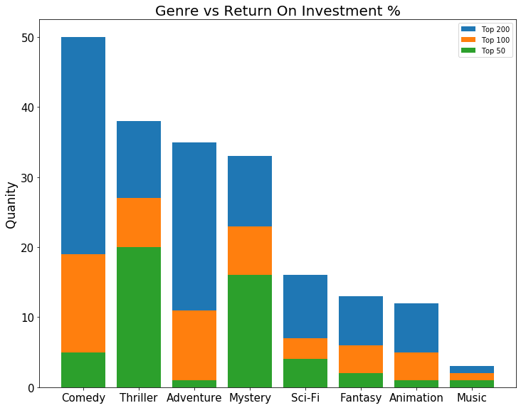

<h1>Table of Contents<span class="tocSkip"></span></h1>
<div class="toc"><ul class="toc-item"><li><span><a href="#Final-Project-Submission" data-toc-modified-id="Final-Project-Submission-1"><span class="toc-item-num">1&nbsp;&nbsp;</span>Final Project Submission</a></span><ul class="toc-item"><li><span><a href="#Introduction" data-toc-modified-id="Introduction-1.1"><span class="toc-item-num">1.1&nbsp;&nbsp;</span>Introduction</a></span></li></ul></li><li><span><a href="#Imports" data-toc-modified-id="Imports-2"><span class="toc-item-num">2&nbsp;&nbsp;</span>Imports</a></span><ul class="toc-item"><li><span><a href="#Importing-modules" data-toc-modified-id="Importing-modules-2.1"><span class="toc-item-num">2.1&nbsp;&nbsp;</span>Importing modules</a></span></li><li><span><a href="#Importing-Data" data-toc-modified-id="Importing-Data-2.2"><span class="toc-item-num">2.2&nbsp;&nbsp;</span>Importing Data</a></span></li><li><span><a href="#Splitting-Out-Rating" data-toc-modified-id="Splitting-Out-Rating-2.3"><span class="toc-item-num">2.3&nbsp;&nbsp;</span>Splitting Out Rating</a></span></li></ul></li><li><span><a href="#Plotting-Domestic-vs-World-Wide-Gross" data-toc-modified-id="Plotting-Domestic-vs-World-Wide-Gross-3"><span class="toc-item-num">3&nbsp;&nbsp;</span>Plotting Domestic vs World Wide Gross</a></span><ul class="toc-item"><li><span><a href="#Cleaning" data-toc-modified-id="Cleaning-3.1"><span class="toc-item-num">3.1&nbsp;&nbsp;</span>Cleaning</a></span></li><li><span><a href="#Plotting" data-toc-modified-id="Plotting-3.2"><span class="toc-item-num">3.2&nbsp;&nbsp;</span>Plotting</a></span></li></ul></li><li><span><a href="#Adding-ROI-and-Combining-Info-Into-Larger-Frame" data-toc-modified-id="Adding-ROI-and-Combining-Info-Into-Larger-Frame-4"><span class="toc-item-num">4&nbsp;&nbsp;</span>Adding ROI and Combining Info Into Larger Frame</a></span><ul class="toc-item"><li><span><a href="#Join-Info-to-the-Scraped-Data" data-toc-modified-id="Join-Info-to-the-Scraped-Data-4.1"><span class="toc-item-num">4.1&nbsp;&nbsp;</span>Join Info to the Scraped Data</a></span></li><li><span><a href="#Min-and-Max-ROIs" data-toc-modified-id="Min-and-Max-ROIs-4.2"><span class="toc-item-num">4.2&nbsp;&nbsp;</span>Min and Max ROIs</a></span></li></ul></li><li><span><a href="#Plotting-Top-Genres" data-toc-modified-id="Plotting-Top-Genres-5"><span class="toc-item-num">5&nbsp;&nbsp;</span>Plotting Top Genres</a></span><ul class="toc-item"><li><span><a href="#Cleaning" data-toc-modified-id="Cleaning-5.1"><span class="toc-item-num">5.1&nbsp;&nbsp;</span>Cleaning</a></span><ul class="toc-item"><li><span><a href="#Which-genre-would-have-the-greatest-return-on-investment?" data-toc-modified-id="Which-genre-would-have-the-greatest-return-on-investment?-5.1.1"><span class="toc-item-num">5.1.1&nbsp;&nbsp;</span>Which genre would have the greatest return on investment?</a></span></li></ul></li><li><span><a href="#Plotting" data-toc-modified-id="Plotting-5.2"><span class="toc-item-num">5.2&nbsp;&nbsp;</span>Plotting</a></span></li></ul></li><li><span><a href="#Directors" data-toc-modified-id="Directors-6"><span class="toc-item-num">6&nbsp;&nbsp;</span>Directors</a></span><ul class="toc-item"><li><span><a href="#Getting-the-Names-of-directors-and-writers" data-toc-modified-id="Getting-the-Names-of-directors-and-writers-6.1"><span class="toc-item-num">6.1&nbsp;&nbsp;</span>Getting the Names of directors and writers</a></span></li><li><span><a href="#Plotting-ROI-vs-Director-Quantity" data-toc-modified-id="Plotting-ROI-vs-Director-Quantity-6.2"><span class="toc-item-num">6.2&nbsp;&nbsp;</span>Plotting ROI vs Director Quantity</a></span><ul class="toc-item"><li><span><a href="#Cleaning" data-toc-modified-id="Cleaning-6.2.1"><span class="toc-item-num">6.2.1&nbsp;&nbsp;</span>Cleaning</a></span></li><li><span><a href="#Plotting" data-toc-modified-id="Plotting-6.2.2"><span class="toc-item-num">6.2.2&nbsp;&nbsp;</span>Plotting</a></span></li></ul></li><li><span><a href="#Plotting-Directors-vs-Mean-ROI" data-toc-modified-id="Plotting-Directors-vs-Mean-ROI-6.3"><span class="toc-item-num">6.3&nbsp;&nbsp;</span>Plotting Directors vs Mean ROI</a></span><ul class="toc-item"><li><span><a href="#Cleaning" data-toc-modified-id="Cleaning-6.3.1"><span class="toc-item-num">6.3.1&nbsp;&nbsp;</span>Cleaning</a></span></li><li><span><a href="#Plotting" data-toc-modified-id="Plotting-6.3.2"><span class="toc-item-num">6.3.2&nbsp;&nbsp;</span>Plotting</a></span></li></ul></li></ul></li><li><span><a href="#Writers" data-toc-modified-id="Writers-7"><span class="toc-item-num">7&nbsp;&nbsp;</span>Writers</a></span><ul class="toc-item"><li><span><a href="#Plotting-ROI-vs-Writer-Quantity" data-toc-modified-id="Plotting-ROI-vs-Writer-Quantity-7.1"><span class="toc-item-num">7.1&nbsp;&nbsp;</span>Plotting ROI vs Writer Quantity</a></span><ul class="toc-item"><li><span><a href="#Cleaning" data-toc-modified-id="Cleaning-7.1.1"><span class="toc-item-num">7.1.1&nbsp;&nbsp;</span>Cleaning</a></span></li><li><span><a href="#Plotting" data-toc-modified-id="Plotting-7.1.2"><span class="toc-item-num">7.1.2&nbsp;&nbsp;</span>Plotting</a></span></li></ul></li><li><span><a href="#Plotting-ROI-vs-Writer-Quantity" data-toc-modified-id="Plotting-ROI-vs-Writer-Quantity-7.2"><span class="toc-item-num">7.2&nbsp;&nbsp;</span>Plotting ROI vs Writer Quantity</a></span><ul class="toc-item"><li><span><a href="#Cleaning" data-toc-modified-id="Cleaning-7.2.1"><span class="toc-item-num">7.2.1&nbsp;&nbsp;</span>Cleaning</a></span></li><li><span><a href="#Plotting" data-toc-modified-id="Plotting-7.2.2"><span class="toc-item-num">7.2.2&nbsp;&nbsp;</span>Plotting</a></span></li></ul></li></ul></li><li><span><a href="#Scraping-the-data" data-toc-modified-id="Scraping-the-data-8"><span class="toc-item-num">8&nbsp;&nbsp;</span>Scraping the data</a></span><ul class="toc-item"><li><span><a href="#Creating-the-indexes-to-be-split" data-toc-modified-id="Creating-the-indexes-to-be-split-8.1"><span class="toc-item-num">8.1&nbsp;&nbsp;</span>Creating the indexes to be split</a></span></li><li><span><a href="#Splitting-the-data-to-be-scraped" data-toc-modified-id="Splitting-the-data-to-be-scraped-8.2"><span class="toc-item-num">8.2&nbsp;&nbsp;</span>Splitting the data to be scraped</a></span></li><li><span><a href="#Sending-the-python-file" data-toc-modified-id="Sending-the-python-file-8.3"><span class="toc-item-num">8.3&nbsp;&nbsp;</span>Sending the python file</a></span></li><li><span><a href="#Rescraping" data-toc-modified-id="Rescraping-8.4"><span class="toc-item-num">8.4&nbsp;&nbsp;</span>Rescraping</a></span></li><li><span><a href="#Combining-the-data" data-toc-modified-id="Combining-the-data-8.5"><span class="toc-item-num">8.5&nbsp;&nbsp;</span>Combining the data</a></span></li></ul></li><li><span><a href="#End" data-toc-modified-id="End-9"><span class="toc-item-num">9&nbsp;&nbsp;</span>End</a></span></li></ul></div>

## Final Project Submission

Please fill out:
* Student name: Sam Stoltenberg
* Student pace: full time
* Scheduled project review date/time: 8/7/2020 6:00PM
* Instructor name: James Irving
* Blog post URL:  https://skelouse.github.io/project_placeholder


### Introduction

The goal was to find the most profitable way a movie could be created for Microsoft.

I started out by getting and combining the data.  The first piece of the data being downloaded from https://datasets.imdbws.com/.
The second piece of the data being scraped `see secion 8` from the IMDB website containing revenue and rating information.  That can be found in this repository `%\scraped_data\budget_ratings.csv`


`Section 3`I searched worldwide vs domestic grosses compared to budget to find which market to strive for.  Showing the obvious that a worldwide movie would provide a greater return.


`Section 4`
I created an ROI or Return on investment % indicator which is defined as (worldwide_gross - budget) / (budget)


`Section 5`
I searched for the most profitable Genre by grouping the dataset by genre, and coming up with a data set where a (Comedy, Thriller) would be two separate entries in the data.  Then plotting that to the ROI based on the genres. Showing that a Mystery or Animated movie would be ideal


`Section 6` I searched for whether one director or multiple would be better, and which directors would be best suited for profitability.  Showing that one would be best, and deriving a top 10 list from the mean of the directors combined movie ROIs.


## Imports

### Importing modules


```python
# Relevant imports
# What time period this is what's analyzed, ecided to use ww gross
# SOOO microsoft should do this after as shown
import os
import pandas as pd
import pandasql as ps
import numpy as np
import seaborn as sns
import matplotlib.pyplot as plt
pd.set_option('mode.chained_assignment', None)

```

### Importing Data


```python
store_folder = 'Data'
data = {}  # dictionary of dataframes
total_size = 0  # size of all of the files
for filename in os.listdir(store_folder):
    path = (store_folder+'/'+filename)
    size = os.stat(path).st_size/(1024**2)  # gets the size of the file in MB
    total_size += size
    print("reading", filename, size, 'MB')
    try:
        if path.endswith('tsv.gz'):  # for tsv files
            data[filename[:-7]] = pd.read_csv(path,
                                                delimiter='\t',
                                                low_memory=False)
        else:  # for csv files
            data[filename[:-7]] = pd.read_csv(path,
                                                low_memory=False)
    except UnicodeDecodeError:
        # Changing encoding to reflect utf-8 unknown characters
        if path.endswith('tsv.gz'):
            data[filename[:-7]] = pd.read_csv(path,
                                            delimiter='\t',
                                            low_memory=False,
                                            encoding='windows-1252')
        else:
            data[filename[:-7]] = pd.read_csv(path,
                                            low_memory=False,
                                            encoding='windows-1252')
print('Done loading %s MB' % total_size)
```

    reading imdb.name.basics.tsv.gz 190.70305347442627 MB
    reading imdb.title.akas.tsv.gz 189.05681037902832 MB
    reading imdb.title.basics.tsv.gz 119.10677146911621 MB
    reading imdb.title.crew.tsv.gz 47.09960460662842 MB
    reading imdb.title.episode.tsv.gz 26.076172828674316 MB
    reading imdb.title.principals.tsv.gz 314.29254722595215 MB
    reading imdb.title.ratings.tsv.gz 4.99261474609375 MB
    Done loading 891.3275747299194 MB
    


```python
# Open df from csv that was scraped as a group
data['scraped_money'] = pd.read_csv('scraped_data/budget_ratings.csv', index_col=0)
```


```python
# Loading each of the csv/tsv files into variables for pysql
# Showing the columns for each for reference

# ['nconst', 'primaryName', 'birthYear', 'deathYear', 'primaryProfession', 'knownForTitles']
name_basics = data['imdb.name.basics']

# ['titleId', 'ordering', 'title', 'region', 'language', 'types',
#    'attributes', 'isOriginalTitle']
title_akas = data['imdb.title.akas']

# ['tconst', 'titleType', 'primaryTitle', 'originalTitle', 'isAdult',
#    'startYear', 'endYear', 'runtimeMinutes', 'genres']
title_basics = data['imdb.title.basics']

# ['tconst', 'directors', 'writers']
title_crew = data['imdb.title.crew']

# ['tconst', 'parentTconst', 'seasonNumber', 'episodeNumber']
title_episode = data['imdb.title.episode']

# ['tconst', 'ordering', 'nconst', 'category', 'job', 'characters']
title_principals = data['imdb.title.principals']

# ['tconst', 'averageRating', 'numVotes']
title_ratings = data['imdb.title.ratings']

# ['tconst', 'budget', 'ww_gross', 'rating']
scraped_money = data['scraped_money']
```


```python
# Setting the index of scraped_money to match the rest
scraped_money = scraped_money.set_index('tconst')
```

### Splitting Out Rating


```python
# Taking out the top ratings that have needed values(budget, gross, etc)
# Cleaning ratings below, because of genres in rating column
df = scraped_money
ratings = ['G', 'PG', 'PG-13', 'R']
df['rating'].value_counts().head(10)
```


    NotRated       5834
    R              2272
    PG-13          1265
    TV-MA           949
    Drama           871
    Documentary     811
    TV-14           760
    PG              723
    Unrated         663
    Comedy          573
    Name: rating, dtype: int64


## Plotting Domestic vs World Wide Gross


### Cleaning


```python
# Cleaning up scraped money to remove zeros and null values
# Setting each relevent column to integers
df['rating'] = df['rating'].map(lambda x: np.NaN if x not in ratings else x)
df['budget'] = df['budget'].map(lambda x: np.NaN if x in[None, 0, '0'] else x)
df['gross'] = df['gross'].map(lambda x: np.NaN if x in[None, 0, '0'] else x)
df['ww_gross'] = df['ww_gross'].map(lambda x: np.NaN if x in[None, 0] else x)
df = df.dropna()
df['budget'] = df['budget'].astype('int64')
df['ww_gross'] = df['ww_gross'].astype('int64')
df['gross'] = df['gross'].astype('int64')
df.head()
```


<div>

<table border="1" class="dataframe">
  <thead>
    <tr style="text-align: right;">
      <th></th>
      <th>budget</th>
      <th>gross</th>
      <th>ww_gross</th>
      <th>rating</th>
    </tr>
    <tr>
      <th>tconst</th>
      <th></th>
      <th></th>
      <th></th>
      <th></th>
    </tr>
  </thead>
  <tbody>
    <tr>
      <td>tt3567288</td>
      <td>5000000</td>
      <td>65206105</td>
      <td>98450062</td>
      <td>PG-13</td>
    </tr>
    <tr>
      <td>tt3569230</td>
      <td>30000000</td>
      <td>1872994</td>
      <td>42972994</td>
      <td>R</td>
    </tr>
    <tr>
      <td>tt3576728</td>
      <td>30000000</td>
      <td>490973</td>
      <td>3087832</td>
      <td>PG-13</td>
    </tr>
    <tr>
      <td>tt3602422</td>
      <td>1310000</td>
      <td>38901</td>
      <td>38901</td>
      <td>R</td>
    </tr>
    <tr>
      <td>tt3605418</td>
      <td>2500000</td>
      <td>36336</td>
      <td>5567103</td>
      <td>R</td>
    </tr>
  </tbody>
</table>
</div>


### Plotting


```python
fig, ax = plt.subplots(ncols=1, nrows=1, figsize=(12, 9.5))
sns.regplot("budget", "ww_gross", data=df, ax=ax)
sns.regplot("budget", "gross", data=df, ax=ax)

# Prettify Plot
ax.legend(["Worldwide Gross", "Domestic Gross"])
ax.set_title("Domestic & Worldwide Gross to Budget")
ax.title.set_fontsize(20)
ax.xaxis.label.set_fontsize(20)
ax.yaxis.label.set_fontsize(20)
ax.xaxis.label.set_text("Budget (Billions)")
ax.yaxis.label.set_text("Gross (Billions)")
ax.tick_params(axis='both', which='major', labelsize=15)

# As you can see in the graph below, movies that are worldwide make more
# money than movies that are only released domestically
```


## Adding ROI and Combining Info Into Larger Frame


```python
# Take df(scraped_money) and add a column with the % difference of budget-> ww_gross
# i.e ROI % (Return on investment %)
def compare(budget, gross):
    net = gross - budget
    return net/budget
df['perc'] = compare(df['budget'], df['ww_gross'])
df.sort_values(by='perc', ascending=False)

```


<div>

<table border="1" class="dataframe">
  <thead>
    <tr style="text-align: right;">
      <th></th>
      <th>budget</th>
      <th>gross</th>
      <th>ww_gross</th>
      <th>rating</th>
      <th>perc</th>
    </tr>
    <tr>
      <th>tconst</th>
      <th></th>
      <th></th>
      <th></th>
      <th></th>
      <th></th>
    </tr>
  </thead>
  <tbody>
    <tr>
      <td>tt1560985</td>
      <td>1000000</td>
      <td>53261944</td>
      <td>101758490</td>
      <td>R</td>
      <td>100.758490</td>
    </tr>
    <tr>
      <td>tt7668870</td>
      <td>880000</td>
      <td>26020957</td>
      <td>75462037</td>
      <td>PG-13</td>
      <td>84.752315</td>
    </tr>
    <tr>
      <td>tt1591095</td>
      <td>1500000</td>
      <td>54009150</td>
      <td>99557032</td>
      <td>PG-13</td>
      <td>65.371355</td>
    </tr>
    <tr>
      <td>tt3713166</td>
      <td>1000000</td>
      <td>32482090</td>
      <td>62882090</td>
      <td>R</td>
      <td>61.882090</td>
    </tr>
    <tr>
      <td>tt5052448</td>
      <td>4500000</td>
      <td>176040665</td>
      <td>272495873</td>
      <td>R</td>
      <td>59.554638</td>
    </tr>
    <tr>
      <td>...</td>
      <td>...</td>
      <td>...</td>
      <td>...</td>
      <td>...</td>
      <td>...</td>
    </tr>
    <tr>
      <td>tt5303442</td>
      <td>20000000</td>
      <td>11255</td>
      <td>11255</td>
      <td>R</td>
      <td>-0.999437</td>
    </tr>
    <tr>
      <td>tt4414438</td>
      <td>18000000</td>
      <td>7162</td>
      <td>7162</td>
      <td>R</td>
      <td>-0.999602</td>
    </tr>
    <tr>
      <td>tt0762138</td>
      <td>2500000</td>
      <td>663</td>
      <td>663</td>
      <td>R</td>
      <td>-0.999735</td>
    </tr>
    <tr>
      <td>tt5143890</td>
      <td>18000000</td>
      <td>3259</td>
      <td>3259</td>
      <td>R</td>
      <td>-0.999819</td>
    </tr>
    <tr>
      <td>tt3789946</td>
      <td>2124000</td>
      <td>120</td>
      <td>120</td>
      <td>PG</td>
      <td>-0.999944</td>
    </tr>
  </tbody>
</table>
<p>1343 rows × 5 columns</p>
</div>


### Join Info to the Scraped Data


```python
q1 = """
SELECT DISTINCT tconst, primaryTitle, genres, budget, ww_gross, rating, perc, runtimeMinutes, directors, writers
FROM df
JOIN title_basics tb
USING(tconst)
JOIN title_crew tc
USING(tconst)
JOIN title_akas ta
ON tconst = titleId
"""
```


```python
# Join directors, writers, runtime, title, and genres to my scraped dataframe
# on 'tconst'.
called_df = ps.sqldf(q1, locals())
called_df
```


<div>

<table border="1" class="dataframe">
  <thead>
    <tr style="text-align: right;">
      <th></th>
      <th>tconst</th>
      <th>primaryTitle</th>
      <th>genres</th>
      <th>budget</th>
      <th>ww_gross</th>
      <th>rating</th>
      <th>perc</th>
      <th>runtimeMinutes</th>
      <th>directors</th>
      <th>writers</th>
    </tr>
  </thead>
  <tbody>
    <tr>
      <td>0</td>
      <td>tt0326965</td>
      <td>In My Sleep</td>
      <td>Drama,Mystery,Thriller</td>
      <td>1000000</td>
      <td>30158</td>
      <td>PG-13</td>
      <td>-0.969842</td>
      <td>104</td>
      <td>nm1075006</td>
      <td>nm1075006</td>
    </tr>
    <tr>
      <td>1</td>
      <td>tt0337692</td>
      <td>On the Road</td>
      <td>Adventure,Drama,Romance</td>
      <td>25000000</td>
      <td>9617377</td>
      <td>R</td>
      <td>-0.615305</td>
      <td>124</td>
      <td>nm0758574</td>
      <td>nm0449616,nm1433580</td>
    </tr>
    <tr>
      <td>2</td>
      <td>tt0359950</td>
      <td>The Secret Life of Walter Mitty</td>
      <td>Comedy,Drama,Fantasy</td>
      <td>90000000</td>
      <td>188133322</td>
      <td>PG</td>
      <td>1.090370</td>
      <td>114</td>
      <td>nm0001774</td>
      <td>nm0175726,nm0862122</td>
    </tr>
    <tr>
      <td>3</td>
      <td>tt0365907</td>
      <td>A Walk Among the Tombstones</td>
      <td>Action,Crime,Drama</td>
      <td>28000000</td>
      <td>58834384</td>
      <td>R</td>
      <td>1.101228</td>
      <td>114</td>
      <td>nm0291082</td>
      <td>nm0088747,nm0291082</td>
    </tr>
    <tr>
      <td>4</td>
      <td>tt0369610</td>
      <td>Jurassic World</td>
      <td>Action,Adventure,Sci-Fi</td>
      <td>150000000</td>
      <td>1670400637</td>
      <td>PG-13</td>
      <td>10.136004</td>
      <td>124</td>
      <td>nm1119880</td>
      <td>nm0415425,nm0798646,nm1119880,nm2081046,nm0000341</td>
    </tr>
    <tr>
      <td>...</td>
      <td>...</td>
      <td>...</td>
      <td>...</td>
      <td>...</td>
      <td>...</td>
      <td>...</td>
      <td>...</td>
      <td>...</td>
      <td>...</td>
      <td>...</td>
    </tr>
    <tr>
      <td>1332</td>
      <td>tt9208444</td>
      <td>Impractical Jokers: The Movie</td>
      <td>Comedy</td>
      <td>3000000</td>
      <td>10691091</td>
      <td>PG-13</td>
      <td>2.563697</td>
      <td>92</td>
      <td>nm0376260</td>
      <td>nm0376260,nm2665746,nm2098978,nm1978079,nm1742600</td>
    </tr>
    <tr>
      <td>1333</td>
      <td>tt9214832</td>
      <td>Emma.</td>
      <td>Comedy,Drama</td>
      <td>10000000</td>
      <td>25587304</td>
      <td>PG</td>
      <td>1.558730</td>
      <td>124</td>
      <td>nm2127315</td>
      <td>nm7414254,nm0000807</td>
    </tr>
    <tr>
      <td>1334</td>
      <td>tt9354944</td>
      <td>Jexi</td>
      <td>Comedy,Romance</td>
      <td>5000000</td>
      <td>9342073</td>
      <td>R</td>
      <td>0.868415</td>
      <td>84</td>
      <td>nm0524190,nm0601859</td>
      <td>nm0524190,nm0601859</td>
    </tr>
    <tr>
      <td>1335</td>
      <td>tt9426210</td>
      <td>Weathering with You</td>
      <td>Animation,Drama,Family</td>
      <td>11100000</td>
      <td>193168568</td>
      <td>PG-13</td>
      <td>16.402574</td>
      <td>112</td>
      <td>nm1396121</td>
      <td>nm1396121</td>
    </tr>
    <tr>
      <td>1336</td>
      <td>tt9779516</td>
      <td>I Still Believe</td>
      <td>Biography,Drama,Music</td>
      <td>12000000</td>
      <td>11502842</td>
      <td>PG</td>
      <td>-0.041430</td>
      <td>116</td>
      <td>nm3401779,nm2296528</td>
      <td>nm1705229,nm2296528,nm0348197</td>
    </tr>
  </tbody>
</table>
<p>1337 rows × 10 columns</p>
</div>


### Min and Max ROIs


```python
top_bottom = called_df.copy(deep=True).dropna().sort_values(
    by='perc', ascending=False)
# highest ROI
highest = top_bottom.iloc[:5]
# https://www.imdb.com/title/tt1560985/
highest  # Equivalent to returning just over 100x of budget
```


<div>

<table border="1" class="dataframe">
  <thead>
    <tr style="text-align: right;">
      <th></th>
      <th>tconst</th>
      <th>primaryTitle</th>
      <th>genres</th>
      <th>budget</th>
      <th>ww_gross</th>
      <th>rating</th>
      <th>perc</th>
      <th>runtimeMinutes</th>
      <th>directors</th>
      <th>writers</th>
    </tr>
  </thead>
  <tbody>
    <tr>
      <td>653</td>
      <td>tt1560985</td>
      <td>The Devil Inside</td>
      <td>Horror</td>
      <td>1000000</td>
      <td>101758490</td>
      <td>R</td>
      <td>100.758490</td>
      <td>83</td>
      <td>nm0068587</td>
      <td>nm0068587,nm1834343</td>
    </tr>
    <tr>
      <td>1288</td>
      <td>tt7668870</td>
      <td>Searching</td>
      <td>Drama,Mystery,Thriller</td>
      <td>880000</td>
      <td>75462037</td>
      <td>PG-13</td>
      <td>84.752315</td>
      <td>102</td>
      <td>nm3792134</td>
      <td>nm3792134,nm3539578</td>
    </tr>
    <tr>
      <td>687</td>
      <td>tt1591095</td>
      <td>Insidious</td>
      <td>Horror,Mystery,Thriller</td>
      <td>1500000</td>
      <td>99557032</td>
      <td>PG-13</td>
      <td>65.371355</td>
      <td>103</td>
      <td>nm1490123</td>
      <td>nm1191481</td>
    </tr>
    <tr>
      <td>838</td>
      <td>tt3713166</td>
      <td>Unfriended</td>
      <td>Horror,Mystery,Thriller</td>
      <td>1000000</td>
      <td>62882090</td>
      <td>R</td>
      <td>61.882090</td>
      <td>83</td>
      <td>nm0300174</td>
      <td>nm4532532</td>
    </tr>
    <tr>
      <td>1074</td>
      <td>tt5052448</td>
      <td>Get Out</td>
      <td>Horror,Mystery,Thriller</td>
      <td>4500000</td>
      <td>272495873</td>
      <td>R</td>
      <td>59.554638</td>
      <td>104</td>
      <td>nm1443502</td>
      <td>nm1443502</td>
    </tr>
  </tbody>
</table>
</div>


```python
top_bottom = called_df.copy(deep=True).dropna().sort_values(
    by='perc', ascending=True)
# lowest ROI
lowest = called_df.iloc[:3]
# https://www.imdb.com/title/tt3789946/
lowest  # Equivalent to a nearly 100% loss
```


<div>

<table border="1" class="dataframe">
  <thead>
    <tr style="text-align: right;">
      <th></th>
      <th>tconst</th>
      <th>primaryTitle</th>
      <th>genres</th>
      <th>budget</th>
      <th>ww_gross</th>
      <th>rating</th>
      <th>perc</th>
      <th>runtimeMinutes</th>
      <th>directors</th>
      <th>writers</th>
    </tr>
  </thead>
  <tbody>
    <tr>
      <td>0</td>
      <td>tt0326965</td>
      <td>In My Sleep</td>
      <td>Drama,Mystery,Thriller</td>
      <td>1000000</td>
      <td>30158</td>
      <td>PG-13</td>
      <td>-0.969842</td>
      <td>104</td>
      <td>nm1075006</td>
      <td>nm1075006</td>
    </tr>
    <tr>
      <td>1</td>
      <td>tt0337692</td>
      <td>On the Road</td>
      <td>Adventure,Drama,Romance</td>
      <td>25000000</td>
      <td>9617377</td>
      <td>R</td>
      <td>-0.615305</td>
      <td>124</td>
      <td>nm0758574</td>
      <td>nm0449616,nm1433580</td>
    </tr>
    <tr>
      <td>2</td>
      <td>tt0359950</td>
      <td>The Secret Life of Walter Mitty</td>
      <td>Comedy,Drama,Fantasy</td>
      <td>90000000</td>
      <td>188133322</td>
      <td>PG</td>
      <td>1.090370</td>
      <td>114</td>
      <td>nm0001774</td>
      <td>nm0175726,nm0862122</td>
    </tr>
  </tbody>
</table>
</div>


## Plotting Top Genres

### Cleaning
#### Which genre would have the greatest return on investment?


```python
# Top genre list from Max. Generated by comparing each genre median/mean 
# to the median/mean of all.
# https://github.com/zero731
genre_list = ['Thriller',  'Animation',  'Sci-Fi',  'Mystery',  'Music',
              'Adventure',  'Fantasy',  'Comedy']
def fix_genre(genres):
    """Function to split the genres into lists,
    and remove genres that are not in the list"""
    new_genres = []
    genres = genres.split(',')
    for g in genres:
        if g in genre_list:
            new_genres.append(g)
    return new_genres
genre_df = called_df.copy(deep=True).dropna()
genre_df['genres'] = genre_df['genres'].apply(lambda x: fix_genre(x))

# Remove movies that no longer have a genre
genre_df['genres'] = genre_df['genres'].map(lambda x: np.NaN if not x else x)
genre_df = genre_df.dropna()
```


```python
# Explode genres
# i.e  ['Comedy', 'Animation'] to one row of 'Animation' and one of 'Comedy'
genre_df = genre_df.explode(column='genres')
```


```python
# Sort by ROI %
genre_df = genre_df.sort_values(by='perc', ascending=False)
#genre_df['runtimeMinutes'] = genre_df['runtimeMinutes'].astype('int64')
genre_df.head()
```


<div>

<table border="1" class="dataframe">
  <thead>
    <tr style="text-align: right;">
      <th></th>
      <th>tconst</th>
      <th>primaryTitle</th>
      <th>genres</th>
      <th>budget</th>
      <th>ww_gross</th>
      <th>rating</th>
      <th>perc</th>
      <th>runtimeMinutes</th>
      <th>directors</th>
      <th>writers</th>
    </tr>
  </thead>
  <tbody>
    <tr>
      <td>1288</td>
      <td>tt7668870</td>
      <td>Searching</td>
      <td>Thriller</td>
      <td>880000</td>
      <td>75462037</td>
      <td>PG-13</td>
      <td>84.752315</td>
      <td>102</td>
      <td>nm3792134</td>
      <td>nm3792134,nm3539578</td>
    </tr>
    <tr>
      <td>1288</td>
      <td>tt7668870</td>
      <td>Searching</td>
      <td>Mystery</td>
      <td>880000</td>
      <td>75462037</td>
      <td>PG-13</td>
      <td>84.752315</td>
      <td>102</td>
      <td>nm3792134</td>
      <td>nm3792134,nm3539578</td>
    </tr>
    <tr>
      <td>687</td>
      <td>tt1591095</td>
      <td>Insidious</td>
      <td>Thriller</td>
      <td>1500000</td>
      <td>99557032</td>
      <td>PG-13</td>
      <td>65.371355</td>
      <td>103</td>
      <td>nm1490123</td>
      <td>nm1191481</td>
    </tr>
    <tr>
      <td>687</td>
      <td>tt1591095</td>
      <td>Insidious</td>
      <td>Mystery</td>
      <td>1500000</td>
      <td>99557032</td>
      <td>PG-13</td>
      <td>65.371355</td>
      <td>103</td>
      <td>nm1490123</td>
      <td>nm1191481</td>
    </tr>
    <tr>
      <td>838</td>
      <td>tt3713166</td>
      <td>Unfriended</td>
      <td>Thriller</td>
      <td>1000000</td>
      <td>62882090</td>
      <td>R</td>
      <td>61.882090</td>
      <td>83</td>
      <td>nm0300174</td>
      <td>nm4532532</td>
    </tr>
  </tbody>
</table>
</div>


### Plotting


```python
fig, ax = plt.subplots(figsize=(12, 9.5))
dicta = genre_df['genres'][0:200].value_counts().to_dict()
ax.bar(dicta.keys(), dicta.values())

dicta = genre_df['genres'][0:100].value_counts().to_dict()
ax.bar(dicta.keys(), dicta.values())

dicta = genre_df['genres'][0:50].value_counts().to_dict()
ax.bar(dicta.keys(), dicta.values())

# Prettify plot
ax.legend(["Top 200", "Top 100", "Top 50"])
ax.set_title("Genre vs Return On Investment %")
ax.title.set_fontsize(20)
ax.yaxis.label.set_fontsize(17)
ax.yaxis.label.set_text("Quanity")
ax.tick_params(axis='both', which='major', labelsize=15)
```


```python
fig, ax = plt.subplots(figsize=(20, 5))

# Rainbow palette
colors = ['pink', "red", "orange", 'yellow', "green", "blue", 'purple']

sns.boxplot(x="perc",
            y="genres",
            order=['Mystery', 'Sci-Fi', 'Thriller','Animation',
                   'Comedy', 'Fantasy', 'Music'],
            palette=sns.xkcd_palette(colors),
            data=genre_df,
            ax=ax)

ax.set_title("Genre and Return On Investment %")
ax.title.set_fontsize(25)
ax.yaxis.label.set_text("")
ax.xaxis.label.set_fontsize(23)
ax.xaxis.label.set_text("ROI %")
ax.tick_params(axis='both', which='major', labelsize=20)

# The below graph is showing that a Mystery or Animated movie would have the
# greatest return on investment
```





## Directors

### Getting the Names of directors and writers


```python
# Creating a dataframe of all the names to pull out director's and writer's names
q2 = """
SELECT *
FROM name_basics
"""
name_df = ps.sqldf(q2, locals())
name_df.head()  # Name Dataframe
```


<div>

<table border="1" class="dataframe">
  <thead>
    <tr style="text-align: right;">
      <th></th>
      <th>nconst</th>
      <th>primaryName</th>
      <th>birthYear</th>
      <th>deathYear</th>
      <th>primaryProfession</th>
      <th>knownForTitles</th>
    </tr>
  </thead>
  <tbody>
    <tr>
      <td>0</td>
      <td>nm0000001</td>
      <td>Fred Astaire</td>
      <td>1899</td>
      <td>1987</td>
      <td>soundtrack,actor,miscellaneous</td>
      <td>tt0053137,tt0031983,tt0050419,tt0072308</td>
    </tr>
    <tr>
      <td>1</td>
      <td>nm0000002</td>
      <td>Lauren Bacall</td>
      <td>1924</td>
      <td>2014</td>
      <td>actress,soundtrack</td>
      <td>tt0071877,tt0038355,tt0117057,tt0037382</td>
    </tr>
    <tr>
      <td>2</td>
      <td>nm0000003</td>
      <td>Brigitte Bardot</td>
      <td>1934</td>
      <td>\N</td>
      <td>actress,soundtrack,music_department</td>
      <td>tt0054452,tt0057345,tt0059956,tt0049189</td>
    </tr>
    <tr>
      <td>3</td>
      <td>nm0000004</td>
      <td>John Belushi</td>
      <td>1949</td>
      <td>1982</td>
      <td>actor,soundtrack,writer</td>
      <td>tt0078723,tt0080455,tt0077975,tt0072562</td>
    </tr>
    <tr>
      <td>4</td>
      <td>nm0000005</td>
      <td>Ingmar Bergman</td>
      <td>1918</td>
      <td>2007</td>
      <td>writer,director,actor</td>
      <td>tt0060827,tt0050976,tt0083922,tt0050986</td>
    </tr>
  </tbody>
</table>
</div>


```python
name_df = name_df.set_index('nconst')
name_df.head()
```


<div>

<table border="1" class="dataframe">
  <thead>
    <tr style="text-align: right;">
      <th></th>
      <th>primaryName</th>
      <th>birthYear</th>
      <th>deathYear</th>
      <th>primaryProfession</th>
      <th>knownForTitles</th>
    </tr>
    <tr>
      <th>nconst</th>
      <th></th>
      <th></th>
      <th></th>
      <th></th>
      <th></th>
    </tr>
  </thead>
  <tbody>
    <tr>
      <td>nm0000001</td>
      <td>Fred Astaire</td>
      <td>1899</td>
      <td>1987</td>
      <td>soundtrack,actor,miscellaneous</td>
      <td>tt0053137,tt0031983,tt0050419,tt0072308</td>
    </tr>
    <tr>
      <td>nm0000002</td>
      <td>Lauren Bacall</td>
      <td>1924</td>
      <td>2014</td>
      <td>actress,soundtrack</td>
      <td>tt0071877,tt0038355,tt0117057,tt0037382</td>
    </tr>
    <tr>
      <td>nm0000003</td>
      <td>Brigitte Bardot</td>
      <td>1934</td>
      <td>\N</td>
      <td>actress,soundtrack,music_department</td>
      <td>tt0054452,tt0057345,tt0059956,tt0049189</td>
    </tr>
    <tr>
      <td>nm0000004</td>
      <td>John Belushi</td>
      <td>1949</td>
      <td>1982</td>
      <td>actor,soundtrack,writer</td>
      <td>tt0078723,tt0080455,tt0077975,tt0072562</td>
    </tr>
    <tr>
      <td>nm0000005</td>
      <td>Ingmar Bergman</td>
      <td>1918</td>
      <td>2007</td>
      <td>writer,director,actor</td>
      <td>tt0060827,tt0050976,tt0083922,tt0050986</td>
    </tr>
  </tbody>
</table>
</div>


### Plotting ROI vs Director Quantity

#### Cleaning


```python
# Copy called_df, split directors column, and get the quantity of those splits
director_split_df = called_df.copy(deep=True)
director_split_df['directors'] = director_split_df['directors'].map(
    lambda x: x.split(','))
director_split_df['director_count'] = director_split_df['directors'].map(
    lambda x: len(x))
```

#### Plotting


```python
# How many directors would be ideal
fig, ax = plt.subplots(figsize=(12, 4.75))
sns.regplot("director_count", "perc", data=director_split_df, ax=ax)

# Prettify plot
ax.set_title("ROI % vs Quantity of Directors")
ax.title.set_fontsize(20)
ax.xaxis.label.set_fontsize(20)
ax.yaxis.label.set_fontsize(20)
ax.xaxis.label.set_text("Director Count")
ax.yaxis.label.set_text("Return on Budget %")
ax.tick_params(axis='both', which='major', labelsize=15)

# The graph is showing a downward trend the more directors you have
# So one director would be the best case for Microsoft.
```


### Plotting Directors vs Mean ROI


#### Cleaning


```python
# Remove movies that have more than one director
director_split_df['director_count'] = director_split_df['director_count'].apply(
    lambda x: 1 if x == 1 else np.NaN)
director_split_df = director_split_df.dropna()
director_split_df = director_split_df.drop(columns=['director_count'])
director_split_df['directors'] =  director_split_df['directors'].apply(
    lambda x: x[0])
```


```python
# Get the directors that have made more than one movie
x_directors = director_split_df['directors'].value_counts().apply(
    lambda x: np.NaN if x < 2 else x).dropna()
x_directors[0:5]
```


    nm1347153    7.0
    nm0000229    6.0
    nm0000318    5.0
    nm0000631    5.0
    nm0000095    5.0
    Name: directors, dtype: float64


```python
# Remove all but said directors from df
director_split_df['directors'] = director_split_df['directors'].apply(
    lambda x: x if x in x_directors else np.NaN)
director_split_df = director_split_df.dropna()
director_split_df.head()
```


<div>

<table border="1" class="dataframe">
  <thead>
    <tr style="text-align: right;">
      <th></th>
      <th>tconst</th>
      <th>primaryTitle</th>
      <th>genres</th>
      <th>budget</th>
      <th>ww_gross</th>
      <th>rating</th>
      <th>perc</th>
      <th>runtimeMinutes</th>
      <th>directors</th>
      <th>writers</th>
    </tr>
  </thead>
  <tbody>
    <tr>
      <td>2</td>
      <td>tt0359950</td>
      <td>The Secret Life of Walter Mitty</td>
      <td>Comedy,Drama,Fantasy</td>
      <td>90000000</td>
      <td>188133322</td>
      <td>PG</td>
      <td>1.090370</td>
      <td>114</td>
      <td>nm0001774</td>
      <td>nm0175726,nm0862122</td>
    </tr>
    <tr>
      <td>4</td>
      <td>tt0369610</td>
      <td>Jurassic World</td>
      <td>Action,Adventure,Sci-Fi</td>
      <td>150000000</td>
      <td>1670400637</td>
      <td>PG-13</td>
      <td>10.136004</td>
      <td>124</td>
      <td>nm1119880</td>
      <td>nm0415425,nm0798646,nm1119880,nm2081046,nm0000341</td>
    </tr>
    <tr>
      <td>11</td>
      <td>tt0409847</td>
      <td>Cowboys &amp; Aliens</td>
      <td>Action,Sci-Fi,Thriller</td>
      <td>163000000</td>
      <td>174822325</td>
      <td>PG-13</td>
      <td>0.072530</td>
      <td>119</td>
      <td>nm0269463</td>
      <td>nm0649460,nm0476064,nm0511541,nm1318843,nm1319...</td>
    </tr>
    <tr>
      <td>12</td>
      <td>tt0427152</td>
      <td>Dinner for Schmucks</td>
      <td>Comedy</td>
      <td>69000000</td>
      <td>86855739</td>
      <td>PG-13</td>
      <td>0.258779</td>
      <td>114</td>
      <td>nm0005366</td>
      <td>nm1115862,nm1911349,nm0891554</td>
    </tr>
    <tr>
      <td>13</td>
      <td>tt0429493</td>
      <td>The A-Team</td>
      <td>Action,Adventure,Thriller</td>
      <td>110000000</td>
      <td>177238796</td>
      <td>PG-13</td>
      <td>0.611262</td>
      <td>117</td>
      <td>nm0138620</td>
      <td>nm0138620,nm0089141,nm0940790,nm0526967,nm0004798</td>
    </tr>
  </tbody>
</table>
</div>


```python
# Apply the real names to the director dataframe
director_split_df['name'] = director_split_df['directors'].apply(
                                lambda x: name_df.loc[x]['primaryName'])
```


```python
# Create an order sequence of top 10 directors by mean
# return on budget for their movies
director_order = (director_split_df.groupby('name')['perc'].mean()
             .sort_values(ascending=False)[0:10].keys())
```

#### Plotting


```python
fig, ax = plt.subplots(figsize=(12, 9.5))
sns.barplot('perc', 'name', data=director_split_df, order=director_order)
sns.swarmplot('perc', 'name', data=director_split_df, order=director_order)

# Prettify plot
ax.set_title("Top Directors by Mean Return on Budget for Their Movies")
ax.title.set_fontsize(28)
ax.xaxis.label.set_fontsize(25)
ax.yaxis.label.set_fontsize(25)
ax.xaxis.label.set_text("Return on Investment %")
ax.yaxis.label.set_text("Director Name")
ax.tick_params(axis='both', which='major', labelsize=15)

# Below is a graph showing the top directors that Microsoft would want to use
```


## Writers

### Plotting ROI vs Writer Quantity

#### Cleaning


```python
# Copy called_df, split directors column, and get the quantity of those splits
writer_split_df = called_df.copy(deep=True)
writer_split_df['writers'] = writer_split_df['writers'].map(
    lambda x: x.split(','))
writer_split_df['writer_count'] = writer_split_df['writers'].map(
    lambda x: len(x))
```

#### Plotting


```python
# How many writers would be ideal
fig, ax = plt.subplots(figsize=(12, 4.75))
sns.regplot("writer_count", "perc", data=writer_split_df, ax=ax)

# Prettify plot
ax.set_title("ROI % vs Quantity of Writers")
ax.title.set_fontsize(20)
ax.xaxis.label.set_fontsize(20)
ax.yaxis.label.set_fontsize(20)
ax.xaxis.label.set_text("Writer Count")
ax.yaxis.label.set_text("Return on Budget %")
ax.tick_params(axis='both', which='major', labelsize=15)

# The graph is inconclusive.
```


### Plotting ROI vs Writer Quantity

#### Cleaning


```python
# Remove movies with more than one writer
writer_split_df['writer_count'] = writer_split_df['writer_count'].apply(lambda x: 1 if x == 1 else np.NaN)
writer_split_df = writer_split_df.dropna()
writer_split_df = writer_split_df.drop(columns=['writer_count'])
writer_split_df['writers'] =  writer_split_df['writers'].apply(lambda x: x[0])

```


```python
# Create a list of writers that have written more than one movie
x_writers = writer_split_df['directors'].value_counts().apply(
    lambda x: np.NaN if x < 2 else x).dropna()
x_writers[0:5]
```


    nm0000095    5.0
    nm1347153    5.0
    nm0796117    4.0
    nm0001752    3.0
    nm1938064    3.0
    Name: directors, dtype: float64


```python
# Remove all but said writers from df
writer_split_df['writers'] = writer_split_df['writers'].apply(
    lambda x: x if x in x_writers else np.NaN)
writer_split_df = writer_split_df.dropna()
writer_split_df.head()
```


<div>

<table border="1" class="dataframe">
  <thead>
    <tr style="text-align: right;">
      <th></th>
      <th>tconst</th>
      <th>primaryTitle</th>
      <th>genres</th>
      <th>budget</th>
      <th>ww_gross</th>
      <th>rating</th>
      <th>perc</th>
      <th>runtimeMinutes</th>
      <th>directors</th>
      <th>writers</th>
    </tr>
  </thead>
  <tbody>
    <tr>
      <td>32</td>
      <td>tt0466893</td>
      <td>Margaret</td>
      <td>Drama</td>
      <td>14000000</td>
      <td>564864</td>
      <td>R</td>
      <td>-0.959653</td>
      <td>150</td>
      <td>nm0518836</td>
      <td>nm0518836</td>
    </tr>
    <tr>
      <td>107</td>
      <td>tt0872230</td>
      <td>My Soul to Take</td>
      <td>Horror,Mystery,Thriller</td>
      <td>25000000</td>
      <td>21500813</td>
      <td>R</td>
      <td>-0.139967</td>
      <td>107</td>
      <td>nm0000127</td>
      <td>nm0000127</td>
    </tr>
    <tr>
      <td>108</td>
      <td>tt0873886</td>
      <td>Red State</td>
      <td>Action,Crime,Horror</td>
      <td>4000000</td>
      <td>1874460</td>
      <td>R</td>
      <td>-0.531385</td>
      <td>88</td>
      <td>nm0003620</td>
      <td>nm0003620</td>
    </tr>
    <tr>
      <td>125</td>
      <td>tt0938283</td>
      <td>The Last Airbender</td>
      <td>Action,Adventure,Family</td>
      <td>150000000</td>
      <td>319713881</td>
      <td>PG</td>
      <td>1.131426</td>
      <td>103</td>
      <td>nm0796117</td>
      <td>nm0796117</td>
    </tr>
    <tr>
      <td>245</td>
      <td>tt1171222</td>
      <td>Baggage Claim</td>
      <td>Comedy,Romance</td>
      <td>8500000</td>
      <td>22871096</td>
      <td>PG-13</td>
      <td>1.690717</td>
      <td>96</td>
      <td>nm0847859</td>
      <td>nm0847859</td>
    </tr>
  </tbody>
</table>
</div>


```python
# Apply the real names to the director dataframe
writer_split_df['name'] = writer_split_df['writers'].apply(
                                lambda x: name_df.loc[x]['primaryName'])
```


```python
# Create an order sequence of top 10 writers
writer_order = (writer_split_df.groupby('name')['perc'].mean()
             .sort_values(ascending=False)[0:10].keys())
```

#### Plotting


```python
fig, ax = plt.subplots(figsize=(12, 9.5))
sns.barplot('perc', 'name', data=writer_split_df, order=writer_order)

# Prettify Plot
ax.set_title("Top Writers by Mean Return on Budget for Their Movies")
ax.title.set_fontsize(28)
ax.xaxis.label.set_fontsize(25)
ax.yaxis.label.set_fontsize(25)
ax.xaxis.label.set_text("Return on Investment %")
ax.yaxis.label.set_text("Writer Name")
ax.tick_params(axis='both', which='major', labelsize=15)

# The graph below is showing the top writers Microsoft would want to use if
# they only chose to have a single writer
```


## Scraping the data
The data below was scraped using a group method.  First by splitting up the list of movie indexes (tt000...) into 10 parts for the group, and then sending the respective files to each individual in the group.  After the data was scrapped they returned to me to be combined and returned back as a whole.  For a more detailed outlook, check out my blog post tagged at the top of this README.


Each is tabbed out with a main function so as to not accidentally run this scraping method again.

### Creating the indexes to be split


```python
import pandasql as ps

def main():
    # Here I used a sql query to get my base indices I needed to split the workload across the group
    q1 = """
    SELECT tconst FROM title_ratings
    JOIN title_basics
    USING(tconst)
    WHERE startYear > 2009
    AND (titleType = 'movie' OR titleType = 'tvMovie')
    """

    # Here I have a qlist, and for each indice of the query I am adding it to qlist along with a comma.
    qlist = ''
    x = 0
    df = ps.sqldf(q1, locals())
    for i in df['tconst']:
        x+=1
        qlist += str(i+',')

    # I save qlist to a file `qlist.txt` and move on to splitting it up
    with open('qlist.txt', 'w') as f:
        f.write(qlist)
        
# main()
```

### Splitting the data to be scraped

In hindsight I could have combined the two above codes
with a list of people participating, and have it automatically
save to their given name's file rather then changing the names myself.


```python
import json
import math

def main():
    # Open the qlist.txt I created before
    with open('./qlist.txt', 'r') as f:
        q_list = f.read().split(',')


    num_people_scraping = 10
    # Splitting the qlist by number of people
    num = len(math.ceil(q_list/num_people_scraping))

    x = 0
    done = False
    while not done:
        x += 1
        person_list = ''
        for i in range(num):
            try:
                person_list += str(q_list.pop(0)) + ','
            except IndexError:
                done = True
                break
        # Saving each person's workload to a separate num.txt
        with open('./nums%s.txt'%x, 'w') as f:
            f.write(person_list)
# main()

```

### Sending the python file

To each person I sent the below along with their `name.txt` file


```python
import re
import json
import requests
from bs4 import BeautifulSoup

# They simply had to change the name here to their name, and run this .py file
file_name = 'name.txt'
data = {}

def extract_numbers(string):
    try:
        return int("".join(re.findall(r'\b\d+\b', string)))
    except ValueError:
        return None


def find(soup, q_num):
    budget = None
    gross = None
    ww_gross = None
    rating = None
    # Find the rating
    for div in soup.findAll('div', class_='subtext'):
        rating = (div.text.split('\n')[1].replace(' ', '').replace('\n', ''))

    # Find the budget, gross, ww_gross in page
    for h4 in soup.findAll('h4'):
        if h4.text.startswith('Budget'):
            text = h4.parent.text
            text = text.split(' ')[0]
            budget = extract_numbers(text)
            
        elif h4.text.startswith('Gross USA'):
            text = h4.parent.text
            text = text.split(' ')[2]
            gross = extract_numbers(text)
            
        elif h4.text.startswith('Cumulative Worldwide'):
            text = h4.parent.text
            text = text.split(' ')[3]
            ww_gross = extract_numbers(text)
    # If any, update the data dict() with the new data
    if budget or gross or ww_gross or rating:
        new_data = {
            q_num:{
                'budget': budget,
                'gross': gross,
                'ww_gross': ww_gross,
                'rating': rating
                }
            }
        data.update(new_data)

url = "https://www.imdb.com/title/"
def get_soup(q_num):
    req = requests.get(str(url+q_num))
    return BeautifulSoup(req.content.decode(), 'html.parser')

# Here is where the dictionary is saved to a data.json file
def save(data):
    with open('data.json', 'w') as f:
        json.dump(data, f)


def main():
    with open(file_name, 'r') as f:
        q_list = f.read().split(',')

    x = 0
    # Iterating through the list I created for them
    for num in q_list:
        x += 1
        if x == 100:
            x = 0
            # The dictionary is saved every 100 queries so if it gets stuck,
            # or the computer crashes/goes to sleep the data is still available.
            save(data)
        print('analysing', num)
        find(get_soup(num), num)

    save(data)
    
# main()
```

### Rescraping

I had some issues with the data, mainly pertaining to currency, so using the indexes we had successfully pulled I did a second scrape with my direct group member Miguel.  Here are the changes to the file I used and sent to him, along with the name.txt file.


```python
def extract_budget(string):
    try:
        return int("".join(re.findall(r'\b\d+\b', string)))
    except ValueError:
        return None

def extract_numbers(string):
    try:
        return int("".join(re.findall(r'\b\d+\b', string)))
    except ValueError:
        return None

# Currency conversions as of 8/1/2020
usd_from_GBP = 1.31
usd_from_NOK = 0.11
usd_from_DKK = 0.16
usd_from_AUD = 0.71
usd_from_EUR = 1.18
usd_from_MXN = 0.045

def find(soup, q_num):
    budget = None
    gross = None
    ww_gross = None
    rating = None
    # Find the rating
    for div in soup.findAll('div', class_='subtext'):
        rating = (div.text.split('\n')[1].replace(' ', '').replace('\n', ''))
    # Find the budget, gross, ww_gross in page
    for h4 in soup.findAll('h4'):
        if h4.text.startswith('Budget'):
            text = h4.parent.text
            # Split by currency
            if 'GBP' in text:
                text = text.split(' ')[0].replace('GBP', '')
                budget = int(extract_budget(text)*usd_from_GBP)
            elif 'NOK' in text:
                text = text.split(' ')[0].replace('NOK', '')
                budget = int(extract_budget(text)*usd_from_NOK)
            elif 'DKK' in text:
                text = text.split(' ')[0].replace('DKK', '')
                budget = int(extract_budget(text)*usd_from_DKK)
            elif 'AUD' in text:
                text = text.split(' ')[0].replace('AUD', '')
                budget = int(extract_budget(text)*usd_from_AUD)
            elif 'EUR' in text:
                text = text.split(' ')[0].replace('EUR', '')
                budget = int(extract_budget(text)*usd_from_EUR)
            elif 'MXN' in text:
                text = text.split(' ')[0].replace('MXN', '')
                budget = int(extract_budget(text)*usd_from_MXN)
            elif '$' in text:
                text = text.split(' ')[0]
                budget = extract_budget(text)
            else:
                print('failed', text)
            
        elif h4.text.startswith('Gross USA'):
            # Get the domestic gross
            text = h4.parent.text
            text = text.split(' ')[2]
            gross = extract_numbers(text)
            
        elif h4.text.startswith('Cumulative Worldwide'):
            # Get the Worldwide gross
            text = h4.parent.text
            text = text.split(' ')[3]
            ww_gross = extract_numbers(text)
    if budget or gross or ww_gross or rating:
        # Combine into dictionary
        new_data = {
            q_num:{
                'budget': budget,
                'gross': gross,
                'ww_gross': ww_gross,
                'rating': rating
                }
            }
        # Update main dictionary with data
        data.update(new_data)
```

### Combining the data


```python
import os
import json
import pandas as pd

def main():
    folder_name = 'all_data'  # The folder where the `.json` files were located
    file_list = os.listdir(folder_name)  # A list of files in said folder

    data = {}  # Where I am updating all of the stored files to

    for filename in file_list:
        with open((folder_name +'/'+filename), 'r') as f:
            data.update(json.load(f))

    # transposing my sideways column and reseting the index to reflect the other dataframes
    df = pd.DataFrame.from_dict(data)
    df = df.transpose()
    df = df.reset_index()
    df = df.rename(columns={'index': 'tconst'})

    # Save DataFrame to csv
    df.to_csv('scraped_data/budget_ratings.csv')
    
# main()
```

## End


```python
# Top 10 directors
director_order
```


    Index(['William Brent Bell', 'Jordan Peele', 'James Wan', 'David F. Sandberg',
           'Adam Robitel', 'Christopher Landon', 'Alex Kendrick',
           'M. Night Shyamalan', 'Darren Aronofsky', 'Andy Muschietti'],
          dtype='object', name='name')


A movie should be released wordwide to have more return than a movie only released domestically.

A movie should be a Mystery or Animation for the greatest return on investment.

A solo director should be chosen, and That director should be one from the top 10 list above.


```python

```
