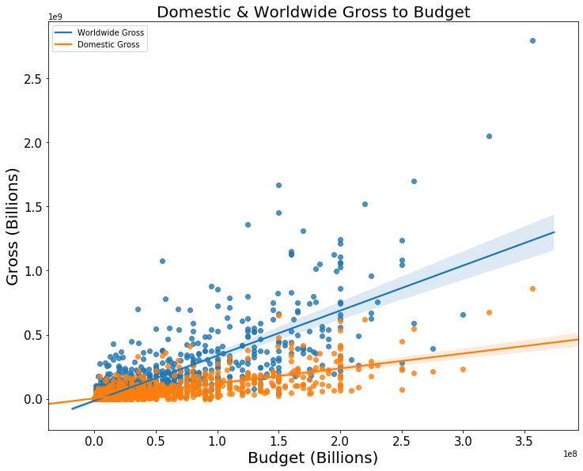
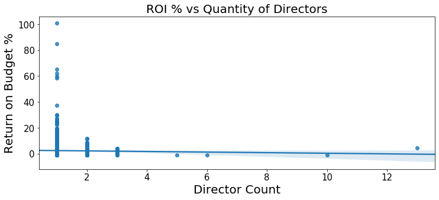
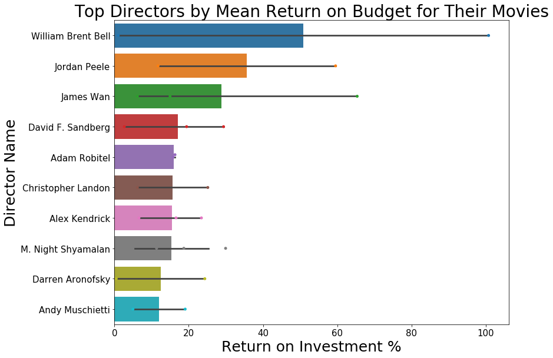
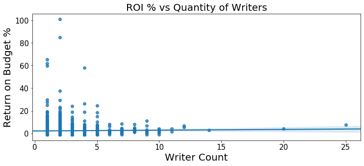
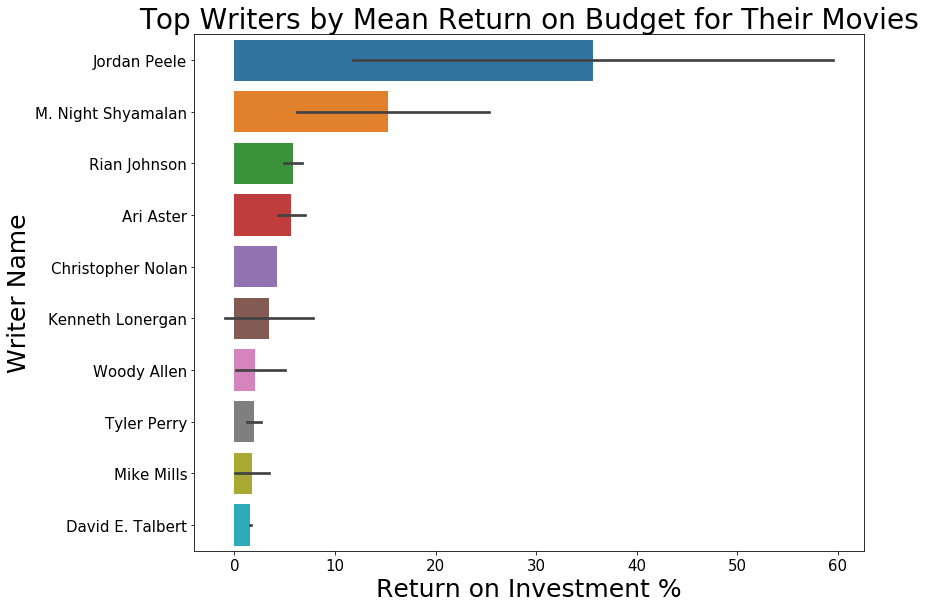

<h1>Table of Contents<span class="tocSkip"></span></h1>
<div class="toc"><ul class="toc-item"><li><span><a href="#Final-Project-Submission" data-toc-modified-id="Final-Project-Submission-1"><span class="toc-item-num">1&nbsp;&nbsp;</span>Final Project Submission</a></span><ul class="toc-item"><li><ul class="toc-item"><li><span><a href="#into" data-toc-modified-id="into-1.0.1"><span class="toc-item-num">1.0.1&nbsp;&nbsp;</span>into</a></span></li></ul></li></ul></li><li><span><a href="#Imports" data-toc-modified-id="Imports-2"><span class="toc-item-num">2&nbsp;&nbsp;</span>Imports</a></span><ul class="toc-item"><li><span><a href="#Importing-modules" data-toc-modified-id="Importing-modules-2.1"><span class="toc-item-num">2.1&nbsp;&nbsp;</span>Importing modules</a></span></li><li><span><a href="#Importing-Data" data-toc-modified-id="Importing-Data-2.2"><span class="toc-item-num">2.2&nbsp;&nbsp;</span>Importing Data</a></span></li><li><span><a href="#Splitting-Out-Rating" data-toc-modified-id="Splitting-Out-Rating-2.3"><span class="toc-item-num">2.3&nbsp;&nbsp;</span>Splitting Out Rating</a></span></li></ul></li><li><span><a href="#Plotting-Domestic-vs-World-Wide-Gross" data-toc-modified-id="Plotting-Domestic-vs-World-Wide-Gross-3"><span class="toc-item-num">3&nbsp;&nbsp;</span>Plotting Domestic vs World Wide Gross</a></span><ul class="toc-item"><li><span><a href="#Cleaning" data-toc-modified-id="Cleaning-3.1"><span class="toc-item-num">3.1&nbsp;&nbsp;</span>Cleaning</a></span></li><li><span><a href="#Plotting" data-toc-modified-id="Plotting-3.2"><span class="toc-item-num">3.2&nbsp;&nbsp;</span>Plotting</a></span></li></ul></li><li><span><a href="#Adding-ROI-and-Combining-Info-Into-Larger-Frame" data-toc-modified-id="Adding-ROI-and-Combining-Info-Into-Larger-Frame-4"><span class="toc-item-num">4&nbsp;&nbsp;</span>Adding ROI and Combining Info Into Larger Frame</a></span><ul class="toc-item"><li><span><a href="#Join-Info-to-the-Scraped-Data" data-toc-modified-id="Join-Info-to-the-Scraped-Data-4.1"><span class="toc-item-num">4.1&nbsp;&nbsp;</span>Join Info to the Scraped Data</a></span></li><li><span><a href="#Min-and-Max-ROIs" data-toc-modified-id="Min-and-Max-ROIs-4.2"><span class="toc-item-num">4.2&nbsp;&nbsp;</span>Min and Max ROIs</a></span></li></ul></li><li><span><a href="#Plotting-Top-Genres" data-toc-modified-id="Plotting-Top-Genres-5"><span class="toc-item-num">5&nbsp;&nbsp;</span>Plotting Top Genres</a></span><ul class="toc-item"><li><span><a href="#Cleaning" data-toc-modified-id="Cleaning-5.1"><span class="toc-item-num">5.1&nbsp;&nbsp;</span>Cleaning</a></span><ul class="toc-item"><li><span><a href="#Which-genre-would-have-the-greatest-return-on-investment?" data-toc-modified-id="Which-genre-would-have-the-greatest-return-on-investment?-5.1.1"><span class="toc-item-num">5.1.1&nbsp;&nbsp;</span>Which genre would have the greatest return on investment?</a></span></li></ul></li><li><span><a href="#Plotting" data-toc-modified-id="Plotting-5.2"><span class="toc-item-num">5.2&nbsp;&nbsp;</span>Plotting</a></span></li></ul></li><li><span><a href="#Directors" data-toc-modified-id="Directors-6"><span class="toc-item-num">6&nbsp;&nbsp;</span>Directors</a></span><ul class="toc-item"><li><span><a href="#Getting-the-Names-of-directors-and-writers" data-toc-modified-id="Getting-the-Names-of-directors-and-writers-6.1"><span class="toc-item-num">6.1&nbsp;&nbsp;</span>Getting the Names of directors and writers</a></span></li><li><span><a href="#Plotting-ROI-vs-Director-Quantity" data-toc-modified-id="Plotting-ROI-vs-Director-Quantity-6.2"><span class="toc-item-num">6.2&nbsp;&nbsp;</span>Plotting ROI vs Director Quantity</a></span><ul class="toc-item"><li><span><a href="#Cleaning" data-toc-modified-id="Cleaning-6.2.1"><span class="toc-item-num">6.2.1&nbsp;&nbsp;</span>Cleaning</a></span></li><li><span><a href="#Plotting" data-toc-modified-id="Plotting-6.2.2"><span class="toc-item-num">6.2.2&nbsp;&nbsp;</span>Plotting</a></span></li></ul></li><li><span><a href="#Plotting-Directors-vs-Mean-ROI" data-toc-modified-id="Plotting-Directors-vs-Mean-ROI-6.3"><span class="toc-item-num">6.3&nbsp;&nbsp;</span>Plotting Directors vs Mean ROI</a></span><ul class="toc-item"><li><span><a href="#Cleaning" data-toc-modified-id="Cleaning-6.3.1"><span class="toc-item-num">6.3.1&nbsp;&nbsp;</span>Cleaning</a></span></li><li><span><a href="#Plotting" data-toc-modified-id="Plotting-6.3.2"><span class="toc-item-num">6.3.2&nbsp;&nbsp;</span>Plotting</a></span></li></ul></li></ul></li><li><span><a href="#Writers" data-toc-modified-id="Writers-7"><span class="toc-item-num">7&nbsp;&nbsp;</span>Writers</a></span><ul class="toc-item"><li><span><a href="#Plotting-ROI-vs-Writer-Quantity" data-toc-modified-id="Plotting-ROI-vs-Writer-Quantity-7.1"><span class="toc-item-num">7.1&nbsp;&nbsp;</span>Plotting ROI vs Writer Quantity</a></span><ul class="toc-item"><li><span><a href="#Cleaning" data-toc-modified-id="Cleaning-7.1.1"><span class="toc-item-num">7.1.1&nbsp;&nbsp;</span>Cleaning</a></span></li><li><span><a href="#Plotting" data-toc-modified-id="Plotting-7.1.2"><span class="toc-item-num">7.1.2&nbsp;&nbsp;</span>Plotting</a></span></li></ul></li><li><span><a href="#Plotting-ROI-vs-Writer-Quantity" data-toc-modified-id="Plotting-ROI-vs-Writer-Quantity-7.2"><span class="toc-item-num">7.2&nbsp;&nbsp;</span>Plotting ROI vs Writer Quantity</a></span><ul class="toc-item"><li><span><a href="#Cleaning" data-toc-modified-id="Cleaning-7.2.1"><span class="toc-item-num">7.2.1&nbsp;&nbsp;</span>Cleaning</a></span></li><li><span><a href="#Plotting" data-toc-modified-id="Plotting-7.2.2"><span class="toc-item-num">7.2.2&nbsp;&nbsp;</span>Plotting</a></span></li></ul></li></ul></li><li><span><a href="#End" data-toc-modified-id="End-8"><span class="toc-item-num">8&nbsp;&nbsp;</span>End</a></span></li></ul></div>

## Final Project Submission

Please fill out:
* Student name: Sam Stoltenberg
* Student pace: full time
* Scheduled project review date/time: 8/7/2020 6:00PM
* Instructor name: James Irving
* Blog post URL:  https://skelouse.github.io/project_placeholder


#### into

## Imports

### Importing modules


```python
# Relevant imports
# What time period this is what's analyzed, ecided to use ww gross
# SOOO microsoft should do this after as shown
import os
import pandas as pd
import pandasql as ps
import numpy as np
import seaborn as sns
import matplotlib.pyplot as plt
pd.set_option('mode.chained_assignment', None)

# download data -> https://datasets.imdbws.com/
```

    
    Bad key "text.kerning_factor" on line 4 in
    C:\Users\12147\anaconda3\envs\learn-env\lib\site-packages\matplotlib\mpl-data\stylelib\_classic_test_patch.mplstyle.
    You probably need to get an updated matplotlibrc file from
    http://github.com/matplotlib/matplotlib/blob/master/matplotlibrc.template
    or from the matplotlib source distribution
    

### Importing Data


```python
store_folder = 'Data'
data = {}  # dictionary of dataframes
total_size = 0  # size of all of the files
for filename in os.listdir(store_folder):
    path = (store_folder+'/'+filename)
    size = os.stat(path).st_size/(1024**2)  # gets the size of the file in MB
    total_size += size
    print("reading", filename, size, 'MB')
    try:
        if path.endswith('tsv.gz'):  # for tsv files
            data[filename[:-7]] = pd.read_csv(path,
                                                delimiter='\t',
                                                low_memory=False)
        else:  # for csv files
            data[filename[:-7]] = pd.read_csv(path,
                                                low_memory=False)
    except UnicodeDecodeError:
        # Changing encoding to reflect utf-8 unknown characters
        if path.endswith('tsv.gz'):
            data[filename[:-7]] = pd.read_csv(path,
                                            delimiter='\t',
                                            low_memory=False,
                                            encoding='windows-1252')
        else:
            data[filename[:-7]] = pd.read_csv(path,
                                            low_memory=False,
                                            encoding='windows-1252')
print('Done loading %s MB' % total_size)
```

    reading imdb.name.basics.tsv.gz 190.70305347442627 MB
    reading imdb.title.akas.tsv.gz 189.05681037902832 MB
    reading imdb.title.basics.tsv.gz 119.10677146911621 MB
    reading imdb.title.crew.tsv.gz 47.09960460662842 MB
    reading imdb.title.episode.tsv.gz 26.076172828674316 MB
    reading imdb.title.principals.tsv.gz 314.29254722595215 MB
    reading imdb.title.ratings.tsv.gz 4.99261474609375 MB
    Done loading 891.3275747299194 MB
    


```python
# Open df from csv that was scraped as a group
data['scraped_money'] = pd.read_csv('scraped_data/budget_ratings.csv', index_col=0)
```


```python
# Loading each of the csv/tsv files into variables for pysql
# Showing the columns for each for reference

# ['nconst', 'primaryName', 'birthYear', 'deathYear', 'primaryProfession', 'knownForTitles']
name_basics = data['imdb.name.basics']

# ['titleId', 'ordering', 'title', 'region', 'language', 'types',
#    'attributes', 'isOriginalTitle']
title_akas = data['imdb.title.akas']

# ['tconst', 'titleType', 'primaryTitle', 'originalTitle', 'isAdult',
#    'startYear', 'endYear', 'runtimeMinutes', 'genres']
title_basics = data['imdb.title.basics']

# ['tconst', 'directors', 'writers']
title_crew = data['imdb.title.crew']

# ['tconst', 'parentTconst', 'seasonNumber', 'episodeNumber']
title_episode = data['imdb.title.episode']

# ['tconst', 'ordering', 'nconst', 'category', 'job', 'characters']
title_principals = data['imdb.title.principals']

# ['tconst', 'averageRating', 'numVotes']
title_ratings = data['imdb.title.ratings']

# ['tconst', 'budget', 'ww_gross', 'rating']
scraped_money = data['scraped_money']
```


```python
# Setting the index of scraped_money to match the rest
scraped_money = scraped_money.set_index('tconst')
```

### Splitting Out Rating


```python
# Taking out the top ratings that have needed values(budget, gross, etc)
# Cleaning ratings below, because of genres in rating column
df = scraped_money
ratings = ['G', 'PG', 'PG-13', 'R']
df['rating'].value_counts().head(10)
```


    NotRated       5834
    R              2272
    PG-13          1265
    TV-MA           949
    Drama           871
    Documentary     811
    TV-14           760
    PG              723
    Unrated         663
    Comedy          573
    Name: rating, dtype: int64


## Plotting Domestic vs World Wide Gross


### Cleaning


```python
# Cleaning up scraped money to remove zeros and null values
# Setting each relevent column to integers
df['rating'] = df['rating'].map(lambda x: np.NaN if x not in ratings else x)
df['budget'] = df['budget'].map(lambda x: np.NaN if x in[None, 0, '0'] else x)
df['gross'] = df['gross'].map(lambda x: np.NaN if x in[None, 0, '0'] else x)
df['ww_gross'] = df['ww_gross'].map(lambda x: np.NaN if x in[None, 0] else x)
df = df.dropna()
df['budget'] = df['budget'].astype('int64')
df['ww_gross'] = df['ww_gross'].astype('int64')
df['gross'] = df['gross'].astype('int64')
df.head()
```


<div>
<style scoped>
    .dataframe tbody tr th:only-of-type {
        vertical-align: middle;
    }

    .dataframe tbody tr th {
        vertical-align: top;
    }

    .dataframe thead th {
        text-align: right;
    }
</style>
<table border="1" class="dataframe">
  <thead>
    <tr style="text-align: right;">
      <th></th>
      <th>budget</th>
      <th>gross</th>
      <th>ww_gross</th>
      <th>rating</th>
    </tr>
    <tr>
      <th>tconst</th>
      <th></th>
      <th></th>
      <th></th>
      <th></th>
    </tr>
  </thead>
  <tbody>
    <tr>
      <td>tt3567288</td>
      <td>5000000</td>
      <td>65206105</td>
      <td>98450062</td>
      <td>PG-13</td>
    </tr>
    <tr>
      <td>tt3569230</td>
      <td>30000000</td>
      <td>1872994</td>
      <td>42972994</td>
      <td>R</td>
    </tr>
    <tr>
      <td>tt3576728</td>
      <td>30000000</td>
      <td>490973</td>
      <td>3087832</td>
      <td>PG-13</td>
    </tr>
    <tr>
      <td>tt3602422</td>
      <td>1310000</td>
      <td>38901</td>
      <td>38901</td>
      <td>R</td>
    </tr>
    <tr>
      <td>tt3605418</td>
      <td>2500000</td>
      <td>36336</td>
      <td>5567103</td>
      <td>R</td>
    </tr>
  </tbody>
</table>
</div>


### Plotting


```python
fig, ax = plt.subplots(ncols=1, nrows=1, figsize=(12, 9.5))
sns.regplot("budget", "ww_gross", data=df, ax=ax)
sns.regplot("budget", "gross", data=df, ax=ax)

# Prettify Plot
ax.legend(["Worldwide Gross", "Domestic Gross"])
ax.set_title("Domestic & Worldwide Gross to Budget")
ax.title.set_fontsize(20)
ax.xaxis.label.set_fontsize(20)
ax.yaxis.label.set_fontsize(20)
ax.xaxis.label.set_text("Budget (Billions)")
ax.yaxis.label.set_text("Gross (Billions)")
ax.tick_params(axis='both', which='major', labelsize=15)
# As you can see, movies that are worldwide make more money than movies
# that are only released domestically
```





## Adding ROI and Combining Info Into Larger Frame


```python
# Take df(scraped_money) and add a column with the % difference of budget-> ww_gross
# i.e ROI % (Return on investment %)
def compare(budget, gross):
    net = gross - budget
    return net/budget
df['perc'] = compare(df['budget'], df['ww_gross'])
df.sort_values(by='perc', ascending=False)

```


<div>
<style scoped>
    .dataframe tbody tr th:only-of-type {
        vertical-align: middle;
    }

    .dataframe tbody tr th {
        vertical-align: top;
    }

    .dataframe thead th {
        text-align: right;
    }
</style>
<table border="1" class="dataframe">
  <thead>
    <tr style="text-align: right;">
      <th></th>
      <th>budget</th>
      <th>gross</th>
      <th>ww_gross</th>
      <th>rating</th>
      <th>perc</th>
    </tr>
    <tr>
      <th>tconst</th>
      <th></th>
      <th></th>
      <th></th>
      <th></th>
      <th></th>
    </tr>
  </thead>
  <tbody>
    <tr>
      <td>tt1560985</td>
      <td>1000000</td>
      <td>53261944</td>
      <td>101758490</td>
      <td>R</td>
      <td>100.758490</td>
    </tr>
    <tr>
      <td>tt7668870</td>
      <td>880000</td>
      <td>26020957</td>
      <td>75462037</td>
      <td>PG-13</td>
      <td>84.752315</td>
    </tr>
    <tr>
      <td>tt1591095</td>
      <td>1500000</td>
      <td>54009150</td>
      <td>99557032</td>
      <td>PG-13</td>
      <td>65.371355</td>
    </tr>
    <tr>
      <td>tt3713166</td>
      <td>1000000</td>
      <td>32482090</td>
      <td>62882090</td>
      <td>R</td>
      <td>61.882090</td>
    </tr>
    <tr>
      <td>tt5052448</td>
      <td>4500000</td>
      <td>176040665</td>
      <td>272495873</td>
      <td>R</td>
      <td>59.554638</td>
    </tr>
    <tr>
      <td>...</td>
      <td>...</td>
      <td>...</td>
      <td>...</td>
      <td>...</td>
      <td>...</td>
    </tr>
    <tr>
      <td>tt5303442</td>
      <td>20000000</td>
      <td>11255</td>
      <td>11255</td>
      <td>R</td>
      <td>-0.999437</td>
    </tr>
    <tr>
      <td>tt4414438</td>
      <td>18000000</td>
      <td>7162</td>
      <td>7162</td>
      <td>R</td>
      <td>-0.999602</td>
    </tr>
    <tr>
      <td>tt0762138</td>
      <td>2500000</td>
      <td>663</td>
      <td>663</td>
      <td>R</td>
      <td>-0.999735</td>
    </tr>
    <tr>
      <td>tt5143890</td>
      <td>18000000</td>
      <td>3259</td>
      <td>3259</td>
      <td>R</td>
      <td>-0.999819</td>
    </tr>
    <tr>
      <td>tt3789946</td>
      <td>2124000</td>
      <td>120</td>
      <td>120</td>
      <td>PG</td>
      <td>-0.999944</td>
    </tr>
  </tbody>
</table>
<p>1343 rows × 5 columns</p>
</div>


### Join Info to the Scraped Data


```python
q1 = """
SELECT DISTINCT tconst, primaryTitle, genres, budget, ww_gross, rating, perc, runtimeMinutes, directors, writers
FROM df
JOIN title_basics tb
USING(tconst)
JOIN title_crew tc
USING(tconst)
JOIN title_akas ta
ON tconst = titleId
"""
```


```python
# Join directors, writers, runtime, title, and genres to my scraped dataframe
# on 'tconst'.
called_df = ps.sqldf(q1, locals())
called_df
```


<div>
<style scoped>
    .dataframe tbody tr th:only-of-type {
        vertical-align: middle;
    }

    .dataframe tbody tr th {
        vertical-align: top;
    }

    .dataframe thead th {
        text-align: right;
    }
</style>
<table border="1" class="dataframe">
  <thead>
    <tr style="text-align: right;">
      <th></th>
      <th>tconst</th>
      <th>primaryTitle</th>
      <th>genres</th>
      <th>budget</th>
      <th>ww_gross</th>
      <th>rating</th>
      <th>perc</th>
      <th>runtimeMinutes</th>
      <th>directors</th>
      <th>writers</th>
    </tr>
  </thead>
  <tbody>
    <tr>
      <td>0</td>
      <td>tt0326965</td>
      <td>In My Sleep</td>
      <td>Drama,Mystery,Thriller</td>
      <td>1000000</td>
      <td>30158</td>
      <td>PG-13</td>
      <td>-0.969842</td>
      <td>104</td>
      <td>nm1075006</td>
      <td>nm1075006</td>
    </tr>
    <tr>
      <td>1</td>
      <td>tt0337692</td>
      <td>On the Road</td>
      <td>Adventure,Drama,Romance</td>
      <td>25000000</td>
      <td>9617377</td>
      <td>R</td>
      <td>-0.615305</td>
      <td>124</td>
      <td>nm0758574</td>
      <td>nm0449616,nm1433580</td>
    </tr>
    <tr>
      <td>2</td>
      <td>tt0359950</td>
      <td>The Secret Life of Walter Mitty</td>
      <td>Comedy,Drama,Fantasy</td>
      <td>90000000</td>
      <td>188133322</td>
      <td>PG</td>
      <td>1.090370</td>
      <td>114</td>
      <td>nm0001774</td>
      <td>nm0175726,nm0862122</td>
    </tr>
    <tr>
      <td>3</td>
      <td>tt0365907</td>
      <td>A Walk Among the Tombstones</td>
      <td>Action,Crime,Drama</td>
      <td>28000000</td>
      <td>58834384</td>
      <td>R</td>
      <td>1.101228</td>
      <td>114</td>
      <td>nm0291082</td>
      <td>nm0088747,nm0291082</td>
    </tr>
    <tr>
      <td>4</td>
      <td>tt0369610</td>
      <td>Jurassic World</td>
      <td>Action,Adventure,Sci-Fi</td>
      <td>150000000</td>
      <td>1670400637</td>
      <td>PG-13</td>
      <td>10.136004</td>
      <td>124</td>
      <td>nm1119880</td>
      <td>nm0415425,nm0798646,nm1119880,nm2081046,nm0000341</td>
    </tr>
    <tr>
      <td>...</td>
      <td>...</td>
      <td>...</td>
      <td>...</td>
      <td>...</td>
      <td>...</td>
      <td>...</td>
      <td>...</td>
      <td>...</td>
      <td>...</td>
      <td>...</td>
    </tr>
    <tr>
      <td>1332</td>
      <td>tt9208444</td>
      <td>Impractical Jokers: The Movie</td>
      <td>Comedy</td>
      <td>3000000</td>
      <td>10691091</td>
      <td>PG-13</td>
      <td>2.563697</td>
      <td>92</td>
      <td>nm0376260</td>
      <td>nm0376260,nm2665746,nm2098978,nm1978079,nm1742600</td>
    </tr>
    <tr>
      <td>1333</td>
      <td>tt9214832</td>
      <td>Emma.</td>
      <td>Comedy,Drama</td>
      <td>10000000</td>
      <td>25587304</td>
      <td>PG</td>
      <td>1.558730</td>
      <td>124</td>
      <td>nm2127315</td>
      <td>nm7414254,nm0000807</td>
    </tr>
    <tr>
      <td>1334</td>
      <td>tt9354944</td>
      <td>Jexi</td>
      <td>Comedy,Romance</td>
      <td>5000000</td>
      <td>9342073</td>
      <td>R</td>
      <td>0.868415</td>
      <td>84</td>
      <td>nm0524190,nm0601859</td>
      <td>nm0524190,nm0601859</td>
    </tr>
    <tr>
      <td>1335</td>
      <td>tt9426210</td>
      <td>Weathering with You</td>
      <td>Animation,Drama,Family</td>
      <td>11100000</td>
      <td>193168568</td>
      <td>PG-13</td>
      <td>16.402574</td>
      <td>112</td>
      <td>nm1396121</td>
      <td>nm1396121</td>
    </tr>
    <tr>
      <td>1336</td>
      <td>tt9779516</td>
      <td>I Still Believe</td>
      <td>Biography,Drama,Music</td>
      <td>12000000</td>
      <td>11502842</td>
      <td>PG</td>
      <td>-0.041430</td>
      <td>116</td>
      <td>nm3401779,nm2296528</td>
      <td>nm1705229,nm2296528,nm0348197</td>
    </tr>
  </tbody>
</table>
<p>1337 rows × 10 columns</p>
</div>


### Min and Max ROIs


```python
top_bottom = called_df.copy(deep=True).dropna().sort_values(
    by='perc', ascending=False)
# highest ROI
highest = top_bottom.iloc[:5]
# https://www.imdb.com/title/tt1560985/
highest  # Equivalent to returning just over 100x of budget
```


<div>
<style scoped>
    .dataframe tbody tr th:only-of-type {
        vertical-align: middle;
    }

    .dataframe tbody tr th {
        vertical-align: top;
    }

    .dataframe thead th {
        text-align: right;
    }
</style>
<table border="1" class="dataframe">
  <thead>
    <tr style="text-align: right;">
      <th></th>
      <th>tconst</th>
      <th>primaryTitle</th>
      <th>genres</th>
      <th>budget</th>
      <th>ww_gross</th>
      <th>rating</th>
      <th>perc</th>
      <th>runtimeMinutes</th>
      <th>directors</th>
      <th>writers</th>
    </tr>
  </thead>
  <tbody>
    <tr>
      <td>653</td>
      <td>tt1560985</td>
      <td>The Devil Inside</td>
      <td>Horror</td>
      <td>1000000</td>
      <td>101758490</td>
      <td>R</td>
      <td>100.758490</td>
      <td>83</td>
      <td>nm0068587</td>
      <td>nm0068587,nm1834343</td>
    </tr>
    <tr>
      <td>1288</td>
      <td>tt7668870</td>
      <td>Searching</td>
      <td>Drama,Mystery,Thriller</td>
      <td>880000</td>
      <td>75462037</td>
      <td>PG-13</td>
      <td>84.752315</td>
      <td>102</td>
      <td>nm3792134</td>
      <td>nm3792134,nm3539578</td>
    </tr>
    <tr>
      <td>687</td>
      <td>tt1591095</td>
      <td>Insidious</td>
      <td>Horror,Mystery,Thriller</td>
      <td>1500000</td>
      <td>99557032</td>
      <td>PG-13</td>
      <td>65.371355</td>
      <td>103</td>
      <td>nm1490123</td>
      <td>nm1191481</td>
    </tr>
    <tr>
      <td>838</td>
      <td>tt3713166</td>
      <td>Unfriended</td>
      <td>Horror,Mystery,Thriller</td>
      <td>1000000</td>
      <td>62882090</td>
      <td>R</td>
      <td>61.882090</td>
      <td>83</td>
      <td>nm0300174</td>
      <td>nm4532532</td>
    </tr>
    <tr>
      <td>1074</td>
      <td>tt5052448</td>
      <td>Get Out</td>
      <td>Horror,Mystery,Thriller</td>
      <td>4500000</td>
      <td>272495873</td>
      <td>R</td>
      <td>59.554638</td>
      <td>104</td>
      <td>nm1443502</td>
      <td>nm1443502</td>
    </tr>
  </tbody>
</table>
</div>


```python
top_bottom = called_df.copy(deep=True).dropna().sort_values(
    by='perc', ascending=True)
# lowest ROI
lowest = called_df.iloc[:3]
# https://www.imdb.com/title/tt3789946/
lowest  # Equivalent to a nearly 100% loss
```


<div>
<style scoped>
    .dataframe tbody tr th:only-of-type {
        vertical-align: middle;
    }

    .dataframe tbody tr th {
        vertical-align: top;
    }

    .dataframe thead th {
        text-align: right;
    }
</style>
<table border="1" class="dataframe">
  <thead>
    <tr style="text-align: right;">
      <th></th>
      <th>tconst</th>
      <th>primaryTitle</th>
      <th>genres</th>
      <th>budget</th>
      <th>ww_gross</th>
      <th>rating</th>
      <th>perc</th>
      <th>runtimeMinutes</th>
      <th>directors</th>
      <th>writers</th>
    </tr>
  </thead>
  <tbody>
    <tr>
      <td>0</td>
      <td>tt0326965</td>
      <td>In My Sleep</td>
      <td>Drama,Mystery,Thriller</td>
      <td>1000000</td>
      <td>30158</td>
      <td>PG-13</td>
      <td>-0.969842</td>
      <td>104</td>
      <td>nm1075006</td>
      <td>nm1075006</td>
    </tr>
    <tr>
      <td>1</td>
      <td>tt0337692</td>
      <td>On the Road</td>
      <td>Adventure,Drama,Romance</td>
      <td>25000000</td>
      <td>9617377</td>
      <td>R</td>
      <td>-0.615305</td>
      <td>124</td>
      <td>nm0758574</td>
      <td>nm0449616,nm1433580</td>
    </tr>
    <tr>
      <td>2</td>
      <td>tt0359950</td>
      <td>The Secret Life of Walter Mitty</td>
      <td>Comedy,Drama,Fantasy</td>
      <td>90000000</td>
      <td>188133322</td>
      <td>PG</td>
      <td>1.090370</td>
      <td>114</td>
      <td>nm0001774</td>
      <td>nm0175726,nm0862122</td>
    </tr>
  </tbody>
</table>
</div>


## Plotting Top Genres

### Cleaning
#### Which genre would have the greatest return on investment?


```python
# Top genre list from Max. Generated by comparing each genre median/mean 
# to the median/mean of all.
# https://github.com/zero731
genre_list = ['Thriller',  'Animation',  'Sci-Fi',  'Mystery',  'Music',
              'Adventure',  'Fantasy',  'Comedy']
def fix_genre(genres):
    """Function to split the genres into lists,
    and remove genres that are not in the list"""
    new_genres = []
    genres = genres.split(',')
    for g in genres:
        if g in genre_list:
            new_genres.append(g)
    return new_genres
genre_df = called_df.copy(deep=True).dropna()
genre_df['genres'] = genre_df['genres'].apply(lambda x: fix_genre(x))

# Remove movies that no longer have a genre
genre_df['genres'] = genre_df['genres'].map(lambda x: np.NaN if not x else x)
genre_df = genre_df.dropna()
```


```python
# Explode genres
# i.e  ['Comedy', 'Animation'] to one row of 'Animation' and one of 'Comedy'
genre_df = genre_df.explode(column='genres')
```


```python
# Sort by ROI %
genre_df = genre_df.sort_values(by='perc', ascending=False)
#genre_df['runtimeMinutes'] = genre_df['runtimeMinutes'].astype('int64')
genre_df.head()
```


<div>
<style scoped>
    .dataframe tbody tr th:only-of-type {
        vertical-align: middle;
    }

    .dataframe tbody tr th {
        vertical-align: top;
    }

    .dataframe thead th {
        text-align: right;
    }
</style>
<table border="1" class="dataframe">
  <thead>
    <tr style="text-align: right;">
      <th></th>
      <th>tconst</th>
      <th>primaryTitle</th>
      <th>genres</th>
      <th>budget</th>
      <th>ww_gross</th>
      <th>rating</th>
      <th>perc</th>
      <th>runtimeMinutes</th>
      <th>directors</th>
      <th>writers</th>
    </tr>
  </thead>
  <tbody>
    <tr>
      <td>1288</td>
      <td>tt7668870</td>
      <td>Searching</td>
      <td>Thriller</td>
      <td>880000</td>
      <td>75462037</td>
      <td>PG-13</td>
      <td>84.752315</td>
      <td>102</td>
      <td>nm3792134</td>
      <td>nm3792134,nm3539578</td>
    </tr>
    <tr>
      <td>1288</td>
      <td>tt7668870</td>
      <td>Searching</td>
      <td>Mystery</td>
      <td>880000</td>
      <td>75462037</td>
      <td>PG-13</td>
      <td>84.752315</td>
      <td>102</td>
      <td>nm3792134</td>
      <td>nm3792134,nm3539578</td>
    </tr>
    <tr>
      <td>687</td>
      <td>tt1591095</td>
      <td>Insidious</td>
      <td>Thriller</td>
      <td>1500000</td>
      <td>99557032</td>
      <td>PG-13</td>
      <td>65.371355</td>
      <td>103</td>
      <td>nm1490123</td>
      <td>nm1191481</td>
    </tr>
    <tr>
      <td>687</td>
      <td>tt1591095</td>
      <td>Insidious</td>
      <td>Mystery</td>
      <td>1500000</td>
      <td>99557032</td>
      <td>PG-13</td>
      <td>65.371355</td>
      <td>103</td>
      <td>nm1490123</td>
      <td>nm1191481</td>
    </tr>
    <tr>
      <td>838</td>
      <td>tt3713166</td>
      <td>Unfriended</td>
      <td>Thriller</td>
      <td>1000000</td>
      <td>62882090</td>
      <td>R</td>
      <td>61.882090</td>
      <td>83</td>
      <td>nm0300174</td>
      <td>nm4532532</td>
    </tr>
  </tbody>
</table>
</div>


### Plotting


```python
fig, ax = plt.subplots(figsize=(12, 9.5))
dicta = genre_df['genres'][0:200].value_counts().to_dict()
ax.bar(dicta.keys(), dicta.values())

dicta = genre_df['genres'][0:100].value_counts().to_dict()
ax.bar(dicta.keys(), dicta.values())

dicta = genre_df['genres'][0:50].value_counts().to_dict()
ax.bar(dicta.keys(), dicta.values())

# Prettify plot
ax.legend(["Top 200", "Top 100", "Top 50"])
ax.set_title("Genre vs Return On Investment %")
ax.title.set_fontsize(20)
ax.yaxis.label.set_fontsize(17)
ax.yaxis.label.set_text("Quanity")
ax.tick_params(axis='both', which='major', labelsize=15)
```


```python
fig, ax = plt.subplots(figsize=(20, 5))

# Rainbow palette
colors = ['pink', "red", "orange", 'yellow', "green", "blue", 'purple']

sns.boxplot(x="perc",
            y="genres",
            order=['Mystery', 'Sci-Fi', 'Thriller','Animation',
                   'Comedy', 'Fantasy', 'Music'],
            palette=sns.xkcd_palette(colors),
            data=genre_df,
            ax=ax)

ax.set_title("Genre vs Return On Investment %")
ax.title.set_fontsize(25)
ax.yaxis.label.set_text("")
ax.xaxis.label.set_fontsize(23)
ax.xaxis.label.set_text("ROI %")
ax.tick_params(axis='both', which='major', labelsize=20)

# The below graph is showing that a Mystery or Sci-Fi would have the greatest
# return on investment
```


## Directors

### Getting the Names of directors and writers


```python
# Creating a dataframe of all the names to pull out director's and writer's names
q2 = """
SELECT *
FROM name_basics
"""
name_df = ps.sqldf(q2, locals())
name_df.head()  # Name Dataframe
```


<div>
<style scoped>
    .dataframe tbody tr th:only-of-type {
        vertical-align: middle;
    }

    .dataframe tbody tr th {
        vertical-align: top;
    }

    .dataframe thead th {
        text-align: right;
    }
</style>
<table border="1" class="dataframe">
  <thead>
    <tr style="text-align: right;">
      <th></th>
      <th>nconst</th>
      <th>primaryName</th>
      <th>birthYear</th>
      <th>deathYear</th>
      <th>primaryProfession</th>
      <th>knownForTitles</th>
    </tr>
  </thead>
  <tbody>
    <tr>
      <td>0</td>
      <td>nm0000001</td>
      <td>Fred Astaire</td>
      <td>1899</td>
      <td>1987</td>
      <td>soundtrack,actor,miscellaneous</td>
      <td>tt0053137,tt0031983,tt0050419,tt0072308</td>
    </tr>
    <tr>
      <td>1</td>
      <td>nm0000002</td>
      <td>Lauren Bacall</td>
      <td>1924</td>
      <td>2014</td>
      <td>actress,soundtrack</td>
      <td>tt0071877,tt0038355,tt0117057,tt0037382</td>
    </tr>
    <tr>
      <td>2</td>
      <td>nm0000003</td>
      <td>Brigitte Bardot</td>
      <td>1934</td>
      <td>\N</td>
      <td>actress,soundtrack,music_department</td>
      <td>tt0054452,tt0057345,tt0059956,tt0049189</td>
    </tr>
    <tr>
      <td>3</td>
      <td>nm0000004</td>
      <td>John Belushi</td>
      <td>1949</td>
      <td>1982</td>
      <td>actor,soundtrack,writer</td>
      <td>tt0078723,tt0080455,tt0077975,tt0072562</td>
    </tr>
    <tr>
      <td>4</td>
      <td>nm0000005</td>
      <td>Ingmar Bergman</td>
      <td>1918</td>
      <td>2007</td>
      <td>writer,director,actor</td>
      <td>tt0060827,tt0050976,tt0083922,tt0050986</td>
    </tr>
  </tbody>
</table>
</div>


```python
name_df = name_df.set_index('nconst')
name_df.head()
```


<div>
<style scoped>
    .dataframe tbody tr th:only-of-type {
        vertical-align: middle;
    }

    .dataframe tbody tr th {
        vertical-align: top;
    }

    .dataframe thead th {
        text-align: right;
    }
</style>
<table border="1" class="dataframe">
  <thead>
    <tr style="text-align: right;">
      <th></th>
      <th>primaryName</th>
      <th>birthYear</th>
      <th>deathYear</th>
      <th>primaryProfession</th>
      <th>knownForTitles</th>
    </tr>
    <tr>
      <th>nconst</th>
      <th></th>
      <th></th>
      <th></th>
      <th></th>
      <th></th>
    </tr>
  </thead>
  <tbody>
    <tr>
      <td>nm0000001</td>
      <td>Fred Astaire</td>
      <td>1899</td>
      <td>1987</td>
      <td>soundtrack,actor,miscellaneous</td>
      <td>tt0053137,tt0031983,tt0050419,tt0072308</td>
    </tr>
    <tr>
      <td>nm0000002</td>
      <td>Lauren Bacall</td>
      <td>1924</td>
      <td>2014</td>
      <td>actress,soundtrack</td>
      <td>tt0071877,tt0038355,tt0117057,tt0037382</td>
    </tr>
    <tr>
      <td>nm0000003</td>
      <td>Brigitte Bardot</td>
      <td>1934</td>
      <td>\N</td>
      <td>actress,soundtrack,music_department</td>
      <td>tt0054452,tt0057345,tt0059956,tt0049189</td>
    </tr>
    <tr>
      <td>nm0000004</td>
      <td>John Belushi</td>
      <td>1949</td>
      <td>1982</td>
      <td>actor,soundtrack,writer</td>
      <td>tt0078723,tt0080455,tt0077975,tt0072562</td>
    </tr>
    <tr>
      <td>nm0000005</td>
      <td>Ingmar Bergman</td>
      <td>1918</td>
      <td>2007</td>
      <td>writer,director,actor</td>
      <td>tt0060827,tt0050976,tt0083922,tt0050986</td>
    </tr>
  </tbody>
</table>
</div>


### Plotting ROI vs Director Quantity

#### Cleaning


```python
# Copy called_df, split directors column, and get the quantity of those splits
director_split_df = called_df.copy(deep=True)
director_split_df['directors'] = director_split_df['directors'].map(
    lambda x: x.split(','))
director_split_df['director_count'] = director_split_df['directors'].map(
    lambda x: len(x))
```

#### Plotting


```python
# How many directors would be ideal
fig, ax = plt.subplots(figsize=(12, 4.75))
sns.regplot("director_count", "perc", data=director_split_df, ax=ax)

# Prettify plot
ax.set_title("ROI % vs Quantity of Directors")
ax.title.set_fontsize(20)
ax.xaxis.label.set_fontsize(20)
ax.yaxis.label.set_fontsize(20)
ax.xaxis.label.set_text("Director Count")
ax.yaxis.label.set_text("Return on Budget %")
ax.tick_params(axis='both', which='major', labelsize=15)

# The graph is showing a downward trend the more directors you have
# So one director would be the best case for Microsoft.
```





### Plotting Directors vs Mean ROI


#### Cleaning


```python
# Remove movies that have more than one director
director_split_df['director_count'] = director_split_df['director_count'].apply(
    lambda x: 1 if x == 1 else np.NaN)
director_split_df = director_split_df.dropna()
director_split_df = director_split_df.drop(columns=['director_count'])
director_split_df['directors'] =  director_split_df['directors'].apply(
    lambda x: x[0])
```


```python
# Get the directors that have made more than one movie
x_directors = director_split_df['directors'].value_counts().apply(
    lambda x: np.NaN if x < 2 else x).dropna()
x_directors[0:5]
```


    nm1347153    7.0
    nm0000229    6.0
    nm0000318    5.0
    nm0000631    5.0
    nm0000095    5.0
    Name: directors, dtype: float64


```python
# Remove all but said directors from df
director_split_df['directors'] = director_split_df['directors'].apply(
    lambda x: x if x in x_directors else np.NaN)
director_split_df = director_split_df.dropna()
director_split_df.head()
```


<div>
<style scoped>
    .dataframe tbody tr th:only-of-type {
        vertical-align: middle;
    }

    .dataframe tbody tr th {
        vertical-align: top;
    }

    .dataframe thead th {
        text-align: right;
    }
</style>
<table border="1" class="dataframe">
  <thead>
    <tr style="text-align: right;">
      <th></th>
      <th>tconst</th>
      <th>primaryTitle</th>
      <th>genres</th>
      <th>budget</th>
      <th>ww_gross</th>
      <th>rating</th>
      <th>perc</th>
      <th>runtimeMinutes</th>
      <th>directors</th>
      <th>writers</th>
    </tr>
  </thead>
  <tbody>
    <tr>
      <td>2</td>
      <td>tt0359950</td>
      <td>The Secret Life of Walter Mitty</td>
      <td>Comedy,Drama,Fantasy</td>
      <td>90000000</td>
      <td>188133322</td>
      <td>PG</td>
      <td>1.090370</td>
      <td>114</td>
      <td>nm0001774</td>
      <td>nm0175726,nm0862122</td>
    </tr>
    <tr>
      <td>4</td>
      <td>tt0369610</td>
      <td>Jurassic World</td>
      <td>Action,Adventure,Sci-Fi</td>
      <td>150000000</td>
      <td>1670400637</td>
      <td>PG-13</td>
      <td>10.136004</td>
      <td>124</td>
      <td>nm1119880</td>
      <td>nm0415425,nm0798646,nm1119880,nm2081046,nm0000341</td>
    </tr>
    <tr>
      <td>11</td>
      <td>tt0409847</td>
      <td>Cowboys &amp; Aliens</td>
      <td>Action,Sci-Fi,Thriller</td>
      <td>163000000</td>
      <td>174822325</td>
      <td>PG-13</td>
      <td>0.072530</td>
      <td>119</td>
      <td>nm0269463</td>
      <td>nm0649460,nm0476064,nm0511541,nm1318843,nm1319...</td>
    </tr>
    <tr>
      <td>12</td>
      <td>tt0427152</td>
      <td>Dinner for Schmucks</td>
      <td>Comedy</td>
      <td>69000000</td>
      <td>86855739</td>
      <td>PG-13</td>
      <td>0.258779</td>
      <td>114</td>
      <td>nm0005366</td>
      <td>nm1115862,nm1911349,nm0891554</td>
    </tr>
    <tr>
      <td>13</td>
      <td>tt0429493</td>
      <td>The A-Team</td>
      <td>Action,Adventure,Thriller</td>
      <td>110000000</td>
      <td>177238796</td>
      <td>PG-13</td>
      <td>0.611262</td>
      <td>117</td>
      <td>nm0138620</td>
      <td>nm0138620,nm0089141,nm0940790,nm0526967,nm0004798</td>
    </tr>
  </tbody>
</table>
</div>


```python
# Apply the real names to the director dataframe
director_split_df['name'] = director_split_df['directors'].apply(
                                lambda x: name_df.loc[x]['primaryName'])
```


```python
# Create an order sequence of top 10 directors by mean
# return on budget for their movies
director_order = (director_split_df.groupby('name')['perc'].mean()
             .sort_values(ascending=False)[0:10].keys())
```

#### Plotting


```python
fig, ax = plt.subplots(figsize=(12, 9.5))
sns.barplot('perc', 'name', data=director_split_df, order=director_order)
sns.swarmplot('perc', 'name', data=director_split_df, order=director_order)

# Prettify plot
ax.set_title("Top Directors by Mean Return on Budget for Their Movies")
ax.title.set_fontsize(28)
ax.xaxis.label.set_fontsize(25)
ax.yaxis.label.set_fontsize(25)
ax.xaxis.label.set_text("Return on Investment %")
ax.yaxis.label.set_text("Director Name")
ax.tick_params(axis='both', which='major', labelsize=15)
```





## Writers

### Plotting ROI vs Writer Quantity

#### Cleaning


```python
# Copy called_df, split directors column, and get the quantity of those splits
writer_split_df = called_df.copy(deep=True)
writer_split_df['writers'] = writer_split_df['writers'].map(
    lambda x: x.split(','))
writer_split_df['writer_count'] = writer_split_df['writers'].map(
    lambda x: len(x))
```

#### Plotting


```python
# How many writers would be ideal
fig, ax = plt.subplots(figsize=(12, 4.75))
sns.regplot("writer_count", "perc", data=writer_split_df, ax=ax)

# Prettify plot
ax.set_title("ROI % vs Quantity of Writers")
ax.title.set_fontsize(20)
ax.xaxis.label.set_fontsize(20)
ax.yaxis.label.set_fontsize(20)
ax.xaxis.label.set_text("Writer Count")
ax.yaxis.label.set_text("Return on Budget %")
ax.tick_params(axis='both', which='major', labelsize=15)

# The graph is showing a downward trend the more writers you have
# So one writer would be the best case for Microsoft.
```





### Plotting ROI vs Writer Quantity

#### Cleaning


```python
# Remove movies with more than one writer
writer_split_df['writer_count'] = writer_split_df['writer_count'].apply(lambda x: 1 if x == 1 else np.NaN)
writer_split_df = writer_split_df.dropna()
writer_split_df = writer_split_df.drop(columns=['writer_count'])
writer_split_df['writers'] =  writer_split_df['writers'].apply(lambda x: x[0])

```


```python
# Create a list of writers that have written more than one movie
x_writers = writer_split_df['directors'].value_counts().apply(
    lambda x: np.NaN if x < 2 else x).dropna()
x_writers[0:5]
```


    nm0000095    5.0
    nm1347153    5.0
    nm0796117    4.0
    nm0001752    3.0
    nm1938064    3.0
    Name: directors, dtype: float64


```python
# Remove all but said writers from df
writer_split_df['writers'] = writer_split_df['writers'].apply(
    lambda x: x if x in x_writers else np.NaN)
writer_split_df = writer_split_df.dropna()
writer_split_df.head()
```


<div>
<style scoped>
    .dataframe tbody tr th:only-of-type {
        vertical-align: middle;
    }

    .dataframe tbody tr th {
        vertical-align: top;
    }

    .dataframe thead th {
        text-align: right;
    }
</style>
<table border="1" class="dataframe">
  <thead>
    <tr style="text-align: right;">
      <th></th>
      <th>tconst</th>
      <th>primaryTitle</th>
      <th>genres</th>
      <th>budget</th>
      <th>ww_gross</th>
      <th>rating</th>
      <th>perc</th>
      <th>runtimeMinutes</th>
      <th>directors</th>
      <th>writers</th>
    </tr>
  </thead>
  <tbody>
    <tr>
      <td>32</td>
      <td>tt0466893</td>
      <td>Margaret</td>
      <td>Drama</td>
      <td>14000000</td>
      <td>564864</td>
      <td>R</td>
      <td>-0.959653</td>
      <td>150</td>
      <td>nm0518836</td>
      <td>nm0518836</td>
    </tr>
    <tr>
      <td>107</td>
      <td>tt0872230</td>
      <td>My Soul to Take</td>
      <td>Horror,Mystery,Thriller</td>
      <td>25000000</td>
      <td>21500813</td>
      <td>R</td>
      <td>-0.139967</td>
      <td>107</td>
      <td>nm0000127</td>
      <td>nm0000127</td>
    </tr>
    <tr>
      <td>108</td>
      <td>tt0873886</td>
      <td>Red State</td>
      <td>Action,Crime,Horror</td>
      <td>4000000</td>
      <td>1874460</td>
      <td>R</td>
      <td>-0.531385</td>
      <td>88</td>
      <td>nm0003620</td>
      <td>nm0003620</td>
    </tr>
    <tr>
      <td>125</td>
      <td>tt0938283</td>
      <td>The Last Airbender</td>
      <td>Action,Adventure,Family</td>
      <td>150000000</td>
      <td>319713881</td>
      <td>PG</td>
      <td>1.131426</td>
      <td>103</td>
      <td>nm0796117</td>
      <td>nm0796117</td>
    </tr>
    <tr>
      <td>245</td>
      <td>tt1171222</td>
      <td>Baggage Claim</td>
      <td>Comedy,Romance</td>
      <td>8500000</td>
      <td>22871096</td>
      <td>PG-13</td>
      <td>1.690717</td>
      <td>96</td>
      <td>nm0847859</td>
      <td>nm0847859</td>
    </tr>
  </tbody>
</table>
</div>


```python
# Apply the real names to the director dataframe
writer_split_df['name'] = writer_split_df['writers'].apply(
                                lambda x: name_df.loc[x]['primaryName'])
```


```python
# Create an order sequence of top 10 writers
writer_order = (writer_split_df.groupby('name')['perc'].mean()
             .sort_values(ascending=False)[0:10].keys())
```

#### Plotting


```python
fig, ax = plt.subplots(figsize=(12, 9.5))
sns.barplot('perc', 'name', data=writer_split_df, order=writer_order)

# Prettify Plot
ax.set_title("Top Writers by Mean Return on Budget for Their Movies")
ax.title.set_fontsize(28)
ax.xaxis.label.set_fontsize(25)
ax.yaxis.label.set_fontsize(25)
ax.xaxis.label.set_text("Return on Investment %")
ax.yaxis.label.set_text("Writer Name")
ax.tick_params(axis='both', which='major', labelsize=15)
```





## End


```python
# Top 10 writers
writer_order
```


    Index(['Jordan Peele', 'M. Night Shyamalan', 'Rian Johnson', 'Ari Aster',
           'Christopher Nolan', 'Kenneth Lonergan', 'Woody Allen', 'Tyler Perry',
           'Mike Mills', 'David E. Talbert'],
          dtype='object', name='name')


```python
# Top 10 directors
director_order
```


    Index(['William Brent Bell', 'Jordan Peele', 'James Wan', 'David F. Sandberg',
           'Adam Robitel', 'Christopher Landon', 'Alex Kendrick',
           'M. Night Shyamalan', 'Darren Aronofsky', 'Andy Muschietti'],
          dtype='object', name='name')


```python
# Build conclusion here
```


```python
# A movie should be released wordwide to have more return than
# a movie only released domestically

# A movie should be a Mystery or sci-fi for the greatest return on investment

# One director should be chosen
# That director should be one from the top 10 list
```
